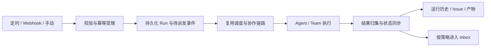

# Automation 能力完善：分析与设计草案

日期：2026-09-07；实现更新：2026-09-08。状态：第一版已实现并完成本地验收，结果见 `test-reports/automation-20260908/REPORT.md`。下文“当前实现与实际差距”保留改造前的基线分析。

分析基于主目录 `/Users/ken/agentscope-2/agentscope-java`、当前分支 `agentscope-service-v5` 的工作区源码；参考 `/Users/ken/agentscope-2/multica` 的 Autopilot 源码、产品文档及用户提供的创建界面截图。当前浏览器访问 Multica 本地地址后跳转登录页，未完成登录后的交互体验。截图里的 Runbook 是产品示例，不是本次需要执行的任务。

## 1. 产品目标与边界

Automation 保存一份可以重复执行的工作约定：做什么、谁执行、使用什么上下文、何时触发、结果如何呈现、何时需要人介入。每次触发都产生独立、可追溯的运行记录。

建议第一版完整交付以下闭环：

- Agent / Team 两类执行方，复用现有 Managed / External Agent 执行与 Team 协作机制。
- 定时、Webhook、手动触发；调度支持常用可视化设置、标准五字段 Cron、IANA 时区及服务端预览。
- 创建可协作 Issue、仅后台运行两种结果呈现方式。
- 创建、编辑、暂停、恢复、归档、立即运行、查看历史及单次结果。
- 幂等受理、进程重启恢复、并发控制、结果回写、人工介入与责任人通知。

Channel 事件接入作为下一阶段能力，须有真实事件订阅、过滤、去重和端到端测试后才标为支持。现有评论和编排动作保留为高级能力；本期主创建流程围绕工作目标和执行方组织。

## 2. 当前实现与实际差距

| 维度 | 当前代码 | 对完善工作的影响 |
|---|---|---|
| 前端创建 | 名称、描述、简化 Cron、Issue 标题和优先级 | 未提供 Runbook、执行方、上下文、Webhook 和输出模式；创建请求未设置执行方，因此不能保证自动启动 Agent |
| 规则与记录 | Automation、AutomationRun；PostgreSQL / memory 持久化；CRUD、归档、触发、历史 API | 可在现有控制面继续演进 |
| 动作 | create_issue、add_comment、start_orchestration、signal_orchestration | 已能进入协作/编排链路，但当前完成状态表示动作提交完成 |
| 调度 | 每 15 秒扫描；部分 Cron 语法；固定 UTC | 工作日、复杂日期与时区能力不足，无预览接口 |
| 幂等 | automationId + idempotencyKey 唯一约束 | 正常重复请求可以返回已有运行；崩溃后的未完成运行尚缺恢复机制 |
| Webhook | 通用 trigger API，可配置 secret hash | 尚非独立的事件投递产品；手动调用和外部触发共用入口与密钥校验 |
| Channel | 枚举与服务层测试包含 channel | 在已检查代码中未发现 Channel 事件订阅到 Automation 的实际转发链路 |
| 历史与结果 | 后端可列运行记录；前端仅列表、启停和立即运行 | 缺详情、运行进度、输出、失败原因和相关 Issue / Task / Session 入口 |

以下是根据调用链确认的缺陷或故障窗口，尚未做浏览器/故障注入复现：

1. **立即运行缺少幂等键。** 前端 `triggerAutomation` 未设置 header，通用 API 客户端也不生成；后端 `Trigger` 强制要求该键。
2. **PATCH 破坏调度状态。** 更新接口由请求重建对象，未保留 `nextRunAt`，直接传给存储；暂停再启用不会重新计算时间。省略描述时也会写成空描述，更新未复用创建时的配置校验。
3. **完成语义不完整。** `Trigger` 在 Issue/Task/编排提交后直接写 `completed` 和 `accepted:true`，没有等待 Agent / Team 的真实结果。当前单元测试也按这一语义断言。
4. **存在丢触发窗口。** `RunDue` 先更新下次运行时间，再开始本次运行；进程在两步之间退出时没有已受理记录可恢复。
5. **存在运行悬挂窗口。** BeginAutomationRun 成功后若进程退出，相同幂等键只返回旧记录，不继续未完成派发。Issue 与 Run 关联也不是一次原子提交。
6. **事件输入传递不一致。** Issue/Comment 动作把输入存到 Run，但创建内容没有包含它；编排动作才显式消费输入。Runbook、Webhook 数据必须有统一传递契约。

现有乐观锁和唯一约束应保留；它们解决并发竞争的一部分，不能替代受理事务和恢复协议。

## 3. 从 Multica 借鉴什么

Multica 的核心对象是 Autopilot、Trigger、Run；创建界面围绕 Runbook、执行方、输出方式、项目、订阅者与触发器展开。源码还包含按计划时间去重、派发恢复、任务/Issue 结果同步、Webhook 投递记录和持续失败暂停。

建议借鉴：

- Runbook 作为创建页主体；名称与执行说明分开。
- 每次运行的原因、配置、输入、执行方、输出和异常都能追踪。
- 规则与触发器分离，单个触发器有自己的启停和调度状态。
- 触发请求的受理结果与实际执行结果分开呈现。
- Webhook 投递有独立记录，能区分过滤、重复、受理和失败。

结合本项目调整：

- Multica Squad 对应 AgentScope Team，但复用我们完整的 leader、子 Issue、汇总及验收机制。
- Multica Project 同时影响业务归属与执行目录；我们要分别说明工作上下文和运行环境，复用已有 workspace/环境绑定。实现前须确认各类 runtime 的覆盖能力，不能直接接受任意服务器本地路径。
- Multica 的 Issue 同步代码可把 `in_review` 记为运行完成；我们应遵循自己的 completion policy，需要人工验收的工作在验收完成前仍显示等待验收。
- Multica 的 run_only 可以直接创建无 Issue 的执行任务；本项目 AgentTask 依赖 Issue，已有 `automation_job`、`operational` 与 `automatic` 模型，适合用后台工作记录承载。
- 通知遵循现有 Inbox 规则：正常后台完成默认不提醒；需要人处理的最终失败、审批或明确请求才升级，显式订阅遵循用户选择。
- 系统暂停阈值应按本产品运行频率设计为可配置策略，不直接照搬 Multica 的统计阈值。

## 4. 建议的领域模型

| 对象 | 核心职责和建议字段 |
|---|---|
| Automation | 名称、Runbook、状态、执行方类型/引用、输出模式、执行上下文、完成策略、负责人、通知策略、并发与超时策略 |
| AutomationRevision | 实质配置变更的不可变快照、版本、发布人和时间；不因调度 tick 增加业务版本 |
| AutomationTrigger | 所属规则、类型、启停、Cron/时区或事件过滤、下次时间、最近触发时间、凭证引用 |
| AutomationRun | 配置快照引用、触发来源、计划时间、受理时间、幂等键、输入、状态、等待原因、执行引用、结果、错误与耗时 |
| TriggerDelivery | Webhook 接收、校验、过滤、去重、派发状态、关联 Run 与重放来源；可后续扩展到 Channel |

配置更新需使用完整的合并、校验、权限检查和预期版本校验；调度游标单独更新。规则、触发器创建应具有一致的提交边界，避免只保存了一半就自动启动。

建议底层支持一份规则关联多个触发器。主创建页一次选择一个定时或 Webhook 触发器，详情页可添加并管理其他触发器；手动运行是一种运行来源，无须创建手动触发器。

两种输出方式共享执行链路：

| 输出模式 | 用户看到的行为 | 底层建议 |
|---|---|---|
| 创建 Issue | 每次运行生成可讨论、指派、验收的工作 Issue | 复用可见工作 Issue 与现有 completion policy，保留 automation 来源 |
| 仅运行 | 结果、产物和日志在 Automation 历史查看 | `kind=automation_job`、`visibility=operational`、`completionPolicy=automatic`，复用 AgentTask/Team 执行 |

后台记录不会进入普通工作 Issue 列表；显式审批或请求人介入仍有入口。输出模式不能隐含“无审计”或“忽略失败”。

## 5. 执行闭环和默认语义

建议对用户区分排队、运行、等待介入、成功、失败、跳过、取消。等待原因细分为审批、用户输入、人工验收等。重复投递属于受理结果，返回原 Run，不计为新的运行失败。

- **成功：** 遵循本次配置快照的 completion policy。Team 应以完整任务树及最终汇总为准，不能由第一个结束的 AgentTask 判定。
- **暂停：** 停止新触发，已开始的运行继续；停止单次运行是另一项操作。暂停期间手动执行需明确作为“测试运行”，不暗中恢复计划。
- **恢复：** 从当前时间计算后续计划，暂停期间默认不补跑。
- **宕机遗漏：** 采用有时间窗口的 latest-only 补跑策略，合并或跳过的遗漏有可解释记录；不无界补跑所有旧时间点。
- **运行重叠：** 默认同一规则的执行阶段不重叠，重叠触发记为 skipped，并说明已有执行。已执行结束、仅等待人工验收的 Issue 不占用执行并发，避免前一天的报告待验收阻塞次日计划；数据模型需分别记录执行结束和最终验收。多触发器共用该限制；有逐事件处理需求时可选择有界排队策略。
- **Runtime 离线：** 默认持久排队，设置最长排队时间；过期后以明确原因结束。不要把派发失败伪装成执行成功。
- **重试：** 基础设施故障复用既有有界重试；Agent 已产生业务副作用的失败不盲目整单重跑。用户重跑创建新的 Run 并保留来源关系。
- **上下文：** 每次运行有独立输入快照；Runbook 与事件 payload 分开，外部 payload 是任务数据，不获得修改执行权限的能力。
- **配置变化：** 已受理 Run 固定配置版本；实际派发前仍重新校验当前访问权限和执行环境有效性。

这些是草案建议的默认值，最终产品设计需将其写入页面文案、API 契约和测试，避免前后端各自解释。

## 6. 调度与 Webhook 的可靠性要求

1. 定时受理时，在同一事务中建立本次计划/Run、待派发事件并推进调度游标；多实例通过数据库并发控制认领。
2. 派发必须幂等：下游 Issue/工作记录有稳定身份；崩溃后能判断“尚未创建”和“已创建但尚未关联”，恢复同一次运行。
3. Run 状态同步使用持久事件，增加扫描补偿；失去一条实时通知不能导致历史永久 running。
4. 幂等键分别来自计划时间、事件投递 ID、手动操作 ID；同键不同 payload 应拒绝，重试返回原记录。
5. Webhook 与登录用户的手动执行入口分开。Webhook 使用独立凭证、支持轮换，并限制请求体、校验 JSON、限流及按约定验证签名。
6. 先持久受理再异步派发。提供投递与 Run 查询、事件过滤原因、失败信息及可控重放；重放新增记录并保留原记录。
7. 检查租户/namespace 和执行方访问权限；记录规则负责人、配置修改人及手动触发人。

目标是平台内同一次受理不重复创建工作、故障后可恢复。外部工具调用的副作用仍依赖相应工具的幂等能力，不宣称跨系统 exactly-once。

## 7. 页面设计

- **列表：** 名称、执行方、状态、触发摘要、下一次时间、最近运行结果；支持搜索、状态过滤和跳转详情。
- **创建/编辑：** 大面积 Runbook 编辑区；设置区依次为执行方、输出模式、上下文、触发、通知。高级设置容纳并发、超时和完成策略。
- **定时编辑：** 常用频率、工作日与时区；高级 Cron；服务端预览未来数次实际运行时间，保存与预览共用解析规则。
- **Webhook 设置：** 创建后展示可复制的调用信息、事件过滤、密钥轮换与请求示例；凭证默认隐藏。
- **详情：** 概览、触发器、运行历史、设置；可以修改、暂停、恢复、归档及立即运行。
- **运行详情：** 触发来源、输入、Runbook 快照、目标、时间线、结果、产物、错误，以及 Issue/Task/Session 链接。

界面展示真实字段校验错误和跳过/失败原因；点击“立即运行”后能进入刚受理的 Run，不能只显示短暂的 Triggered 文案。

## 8. 实施顺序与阶段出口

| 阶段 | 工作内容 | 阶段出口 |
|---|---|---|
| A：设计定稿 | 确认对象、状态与完成策略、上下文绑定、页面交互、API 和迁移；把本草案转成验收用例 | 每个状态、操作和默认策略都有唯一解释 |
| B：执行主链路 | 修复 PATCH/手动触发；Runbook、Agent/Team、两种输出、不可变快照、结果归集、历史页 | 手动触发 Agent 和 Team，在两种输出模式下都能看到真实结果 |
| C：自动触发与恢复 | Cron/时区/预览、触发器管理、受理事务、Webhook、幂等恢复、重叠和超时策略、权限和通知 | 定时和外部事件稳定进入同一执行链路，故障可恢复 |
| D：综合验收 | 后端与数据库测试、前端测试、真实 Runtime 的浏览器验收、故障注入、构建及部署验证 | 完整证据报告和明确通过/失败项，关键缺陷关闭 |

迁移保留已有规则和历史。旧 Run 的 completed 只能解释为历史派发完成，不能迁移成“已验证 Agent 执行成功”。旧规则缺少执行方时需明确提示待配置；不擅自选择 Agent。现有 actionType 的 API/CLI 调用方式需盘点后制定兼容策略。

## 9. 验收矩阵

| 编号 | 场景 | 必须观察到的结果 |
|---|---|---|
| A01 | Agent / Team × 创建 Issue / 仅运行 | 四条链路都有正确输入和最终结果；仅运行不进入普通 Issue 列表 |
| A02 | 立即运行、快速双击、同请求网络重试 | 一次逻辑操作对应一个 Run 和一组下游工作，可直接打开结果 |
| A03 | 工作日上海 09:00、UTC 定时、夏令时地区 | 预览与实际计划一致；无效规则和时区在保存前给出清楚错误 |
| A04 | 修改名称/Runbook、修改时间、暂停后恢复 | 无关字段不丢失，时间按规则重算，暂停期间不产生自动运行 |
| A05 | 重复 Webhook、同键不同输入、签名错误、轮换凭证、事件过滤 | 重复返回原 Run；冲突拒绝；无效来源和被过滤事件不派发，投递结果可查询 |
| A06 | 上次未结束再次触发；多触发器同规则 | 严格遵守并发策略，跳过/排队有原因，不静默重复工作 |
| A07 | 受理前后、下游创建前后、关联回写前后杀进程 | 重启后按事务边界受理或恢复，无丢失的已受理工作，无重复 Issue/Task，无永久悬挂 Run |
| A08 | 多控制面实例同时扫描到期规则 | 同一计划时间只形成一次有效受理 |
| A09 | Runtime 离线、恢复、排队超时、执行超时 | 排队状态真实可见，恢复后执行或按策略结束，重试有上限 |
| A10 | Team 子任务失败、等待输入、审批、人工验收 | 根 Run 不提前成功；介入、恢复、最终汇总与 Issue 状态一致 |
| A11 | 权限撤销、跨租户引用、归档 | 不发生越权执行，归档停止新运行且历史仍可审计 |
| A12 | 后台成功、显式订阅、需人工处理的最终失败 | Inbox 符合既有通知规则，同一异常不重复轰炸 |
| A13 | 升级旧规则与历史、编辑并发冲突 | 历史语义保留，缺失执行方可识别，旧版本更新被拒绝并可刷新恢复 |

测试分层：纯调度/状态机单元测试；HTTP 与 PostgreSQL 事务/并发集成测试；前端表单/状态测试；浏览器与真实 Agent/Team 端到端验收。故障恢复不能只依赖 memory store 或 Mock。

验收报告记录测试用例、环境与代码版本、请求/响应、Automation/Run/Issue/Task ID、关键截图和结果。实现涉及 Go/前端时运行相应完整检查和构建；涉及 Java runtime 时补充相关模块检查，发布前执行仓库要求的完整验证。

## 10. 本轮证据与验证范围

- 已执行 `go test ./internal/automation`：通过，命中 Go 测试缓存；当前文件包含两个顶层测试，主要覆盖服务层正常触发、幂等返回和推进时间。
- 未修改业务代码；未执行整仓构建、部署或端到端功能验收。
- AgentScope 主要证据：`frontend/src/features/operate/AutomationsPage.tsx`，`frontend/src/api/collaboration.ts`，`frontend/src/lib/apiClient.ts`，`aistio/internal/automation/service.go`，`worker.go`，`aistio/internal/httpapi/collaboration_handler.go`，`aistio/internal/store/{postgres,memory}/collaboration_automations.go`，`aistio/internal/controlplane/model/collaboration.go`。路径均相对于 `agentscope-service/`。
- 复用依据：`aistio/internal/httpapi/agent_endpoint_handler.go` 的后台 Issue 创建方式，`aistio/internal/scheduler/scheduler.go` 的持久调度，`docs/inbox-redesign-plan.md` 的通知和验收规则。
- Multica 主要证据：`packages/views/autopilots/components/autopilot-dialog.tsx`，`packages/core/types/autopilot.ts`，`server/internal/service/autopilot.go`，`server/internal/scheduler/jobs_autopilot.go`，`server/internal/handler/autopilot_webhook.go`，`server/cmd/server/autopilot_failure_monitor.go`，`apps/docs/content/docs/autopilots.zh.mdx`。

## 10. 第一版实际实现（2026-09-08）

- 创建页围绕 Runbook、Agent/Team、输出模式、完成策略、上下文链接与触发器展开；桌面左右独立滚动。运行环境继承执行方绑定。支持订阅自己，API 可设置最多 50 个订阅者。
- 一份 Automation 内的 `execution`、`triggers` 采用 JSONB 聚合保存，触发器保留稳定 UUID；配置修改受版本锁保护。每个 Run 内保存不可变完整配置快照，承担配置 revision 的审计职责，首版没有额外独立 Revision 表。调度游标推进不增加配置版本；编辑事务保留并发推进的游标。
- PostgreSQL 受理事务同时保存 Run、推进游标、写出站事件；worker 持续扫描持久化队列完成派发和结果同步。派发租约、稳定 Issue/Comment ID 和编排幂等键支持部分派发后的恢复。
- Cron 使用标准五字段解析、IANA 时区及服务端预览；`@every` 最小一分钟。默认跳过执行重叠，也可串行排队；最长排队和运行时间可设置。错过的调度在 24 小时窗口内只补最近一次，窗口外记录 skipped。
- Webhook 独立入口 `/hooks/v1/automations/{automationId}/{triggerId}`，通过 Gateway 转发。使用 `X-Automation-Secret` 与稳定 `Idempotency-Key`，密钥仅保存哈希，创建/轮换时显示一次。事件可精确过滤，认证通过的投递可审计和重放。同幂等键的不同 JSON 数据或事件拒绝。
- `run_only` 使用 operational automation_job；普通 Issue 仍遵守 review/automatic。等待人工验收不占执行并发槽。派发前失败和自动化超时通过 Inbox 通知创建者；执行任务的失败/审批继续使用既有通知链路。
- 运行详情展示实际结果、错误、输入快照、Issue、Task、编排图/Session 和产物入口；旧记录显示为历史派发语义，不追认成 Agent 实际完成。

首版边界：尚未实现 Channel 事件接入、供应商 HMAC 签名协议、跨实例共享限流、连续失败自动暂停、规则级项目/Workspace 覆盖配置及历史清理策略。Webhook 当前是共享密钥认证；拒绝认证的请求不保存正文。首版不把以上能力标为已支持。
