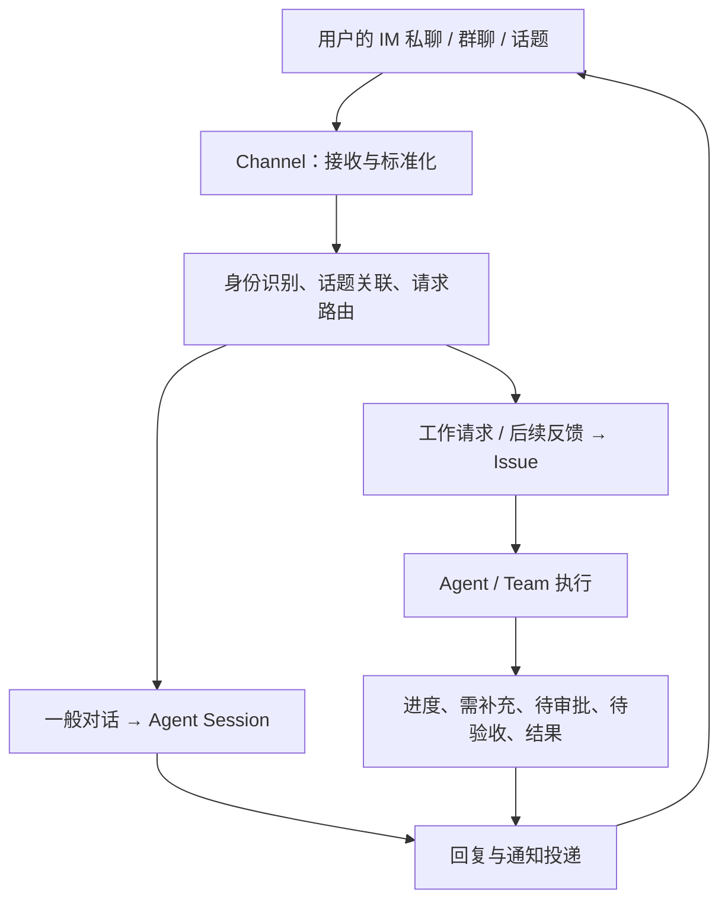
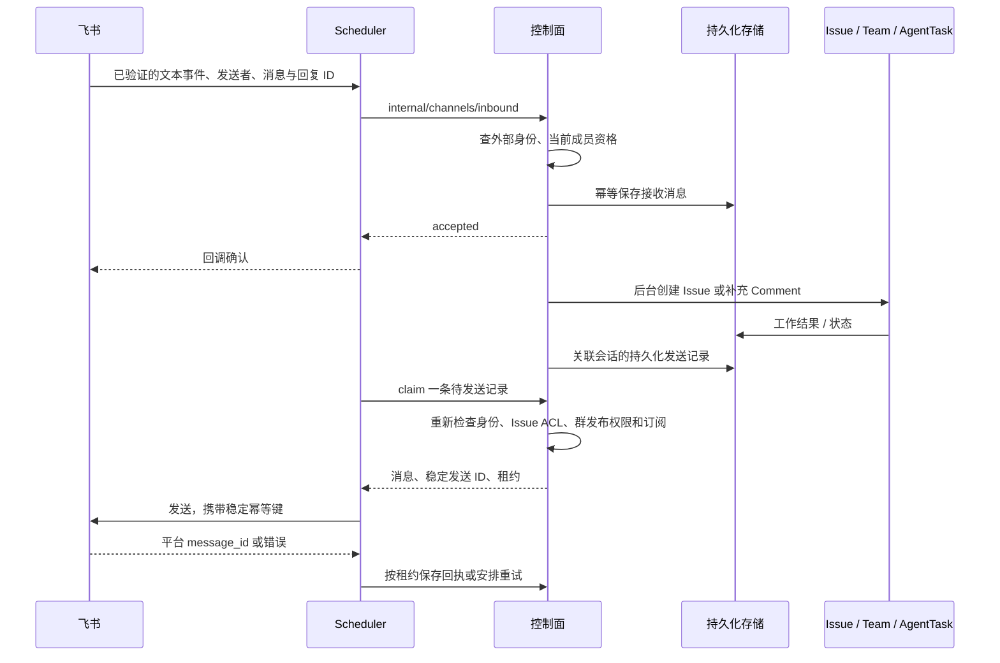

# Channel 总体能力、定位与协作关联设计

日期：2026-09-08。状态：首期工作闭环及接待／回传配置已实施，当前实现与边界见第 13 节。

第 1–12 节保留改造前的设计分析，基于主目录 `/Users/ken/agentscope-2/agentscope-java`、分支 `agentscope-service-v5` 当时的工作区源码。其中“已有／尚未实现”描述的是设计时的基线。第 13 节记录本次实际实现、验证及尚未覆盖的能力，以第 13 节判断当前状态。

本文用于跨 session 传递设计上下文。后续实施前应重新核对当前主目录、分支和相关调用链，保留工作区已有改动。

## 1. 用户需求与核心定位

用户对 Channel 的需求是：Channel 对接用户 IM 软件的聊天窗口，一方面把系统事件发送到聊天窗口，另一方面从聊天窗口接收新的任务或请求。

建议将 Channel 定位为：**用户在 IM 中使用 AgentScope 的双向协作入口，承载“提出工作—跟进进度—补充信息—确认结果”的完整过程。**

消息接收和事件发送是两个基础方向。完整产品价值来自两者之间的关联：

- 系统发出的消息属于哪个 Issue、执行过程或待处理动作。
- 用户回复这条消息后，应推动哪项工作。
- 新消息是一般对话、新工作，还是现有工作的补充、反馈或验收。
- 工作在后台持续执行后，系统仍能找到正确的聊天地址并反馈结果。

因此，Channel 的建设重点是把消息与工作连接起来，形成可持续、可追踪的交互闭环。

## 2. 当前实现与主要差距

| 能力 | 已检查代码中的现状 | 对后续设计的影响 |
|---|---|---|
| 平台连接 | 已有钉钉、飞书、企微，以及 GitHub、GitLab 适配器；有凭证、启停和运行状态管理 | 可以沿用现有连接与适配器基础 |
| 接收消息 | 通过 binding/defaultAgentId 选择 Agent，找到或创建 Managed Session，提交用户消息 | 当前主链路围绕 Agent 对话组织 |
| 返回回复 | 轮询 Session 事件，取得回复并发回 IM；默认等待 120 秒 | 长任务需要独立的后续事件投递机制 |
| 主动发送 | 已有 `/api/outbound/send`，支持指定 channel、peer、thread 发送文本或 Markdown | 已具备发送原语，可作为通知投递的基础 |
| Team、Issue 关联 | 在已检查链路中，未见完整的聊天话题与 Issue 关联、业务事件订阅及回复续接机制 | 工作关联是主要建设方向 |
| Channel Automation | 枚举存在；新执行配置的校验明确返回 `channel triggers are not implemented` | 仍需事件接线、过滤、去重和端到端验收 |

当前主要调用链：

1. 控制面保存 Channel 配置，Scheduler 获取配置并管理适配器生命周期。
2. 平台消息经适配器标准化和路由，进入 `SchedulerGateway`。
3. `SchedulerGateway` 根据 Channel 配置解析 owner 和 Agent，根据消息地址计算 externalKey。
4. `ManagedSessionChannelBridge` 找到或创建 Session，提交用户文本，等待 Session 事件。
5. 适配器将取得的 Agent 回复发回原聊天地址。

需要明确的实现细节：

- 现有 binding 中的 `team` 用于匹配 IM 来源中的 team，最终仍选择 `agentId`。它不表示已经支持 AgentScope 的协作 Team。
- 桥接超时后，当前回复会提示用户稍后再问；不能据此认定已经建立了长任务完成后自动回推的闭环。
- 桥接遇到工具确认时，当前提示用户前往控制台确认；IM 内完成待处理动作仍需接入相应业务流程。
- 当前 Scheduler 桥接主要传递 owner、Agent、会话 key 和文本。实际发言者、外部消息 ID、回复关系等信息需要贯穿工作接入链路。
- 以飞书实现为例，`deliver` 异步发送，错误写入日志。因此上层发送接口返回成功不能直接当作平台已送达。

源码依据见第 12 节。

## 3. 领域职责与对象关系

| 对象 | 回答的问题 | 与 Channel 的关系 |
|---|---|---|
| Channel | 用户通过哪个外部连接交流？ | 管理平台连接、接收和投递 |
| Conversation / Thread | 用户正在讨论哪个话题？ | 定位私聊、群聊、话题及回复关系；建议显式建模 |
| Agent | 谁提供能力、处理请求？ | 可以作为默认接待者或具体执行者 |
| Team | 哪个团队负责组织协作？ | 可以承接请求，通过团队机制分解和汇总 |
| Issue | 这件事是什么、进行到哪里、何时算完成？ | 承载从 IM 发起或在 IM 跟进的工作 |
| Session / Run | 工作具体如何执行？ | 保存对话或执行过程，通过关联找到对应工作 |
| Inbox / 通知 | 谁需要关注或采取行动？ | Channel 是将信息送达用户的外部途径 |

当前 Channel 配置更接近一个机器人或平台连接；用户实际面对的是该连接覆盖的某个私聊、群聊或话题。

一个机器人可以进入多个群，一个群可以同时讨论多个 Issue，一个 Issue 也可以由多个聊天位置跟进。因此需要区分平台连接、聊天上下文、业务工作和执行会话，不能仅依靠 `channelId → agentId` 表达全部关系。

Channel 应保留为可独立管理的连接资源。Agent、Team 详情展示指向自身的关联入口；平台凭证、全局启停和跨目标规则由 Channel 统一管理。绑定引用稳定的逻辑对象，不绑定会重启、扩缩容或换代的 AgentInstance。

## 4. 与 Agent、Team 的关联：谁接待、谁承接

建议将现有 binding 演进为显式目标引用，如 `targetType + targetRef`，保留对逻辑 Agent 的绑定，并增加 Team 等目标。

典型配置：

- 私聊机器人：默认由个人助理 Agent 接待。
- 产品需求群：新工作默认交给产品分析 Team。
- 运维群：特定类型请求交给故障处理 Team。
- 已关联工作的话题：后续消息继续作用于原 Issue。

当目标是 Team 时，应进入“创建或关联 Issue → 分配给 Team → 团队组织执行”的路径，保留团队策略、成员协作、子任务和结果汇总。仅把消息交给 Team Leader 的普通 Session，不能充分表达团队协作语义。

Agent 可以承担自然语言接待、需求澄清和请求理解。确定的回复关联、身份校验、去重和状态操作由服务层处理，并调用现有协作能力。

## 5. 与 Issue 的关联：这个聊天话题在推动哪件事

建议支持两类交互：

| 交互类型 | 典型内容 | 建议处理方式 |
|---|---|---|
| 一般对话 | 咨询、解释、探索 | 进入 Agent Session；有需要时转为可跟踪工作 |
| 工作交互 | 明确委托、长任务、团队协作、后续补充或验收 | 创建或关联 Issue，复用工作生命周期 |

不要求每条消息都创建一个用户可见的 Issue。需要持续跟踪的工作才应具有明确目标、负责人、状态和完成标准。

建议采用以下上下文解析优先级：

1. 用户回复某条系统消息：根据外部消息与内部对象的映射，关联 Issue、Comment 或 Approval。
2. 用户明确引用 Issue 编号：进入对应工作，并校验访问权限。
3. 当前话题已经关联唯一工作：按该工作上下文继续。
4. 无明确关联：使用 Channel 的默认接待规则，判断一般对话或新工作。

当一个群里同时存在多项工作，用户说“继续”时，应要求其选择对应工作，不能简单续接群内最近一次 Session。

Issue 已有 `sourceType/sourceRef`，可记录最初来自哪个聊天话题。但来源信息不足以表达后续多处跟进、跨平台订阅和逐条回复映射，应增加独立的工作关联与消息关联记录。

新任务与后续输入要明确区分：对已关联 Issue 的补充进入现有评论和任务输入链路；明确独立的新任务可以建立新的 Issue 及关联，避免整段群聊长期共用一个工作上下文。

## 6. 接收路由与发送订阅分别配置

两个方向分别回答：

- **接收路由**：这个聊天位置的新请求默认交给谁？
- **发送订阅**：哪些工作的哪些事件需要发送到这个聊天位置？

例如，运维群默认由运维 Team 承接，不意味着该 Team 的所有工作都应发送到这个群。控制台创建的 Issue，也可以由用户选择在 IM 中持续接收通知。

建议出站支持三种用途：

| 用途 | 典型内容 | 目标选择 |
|---|---|---|
| 请求回执和直接回复 | 已受理、关联 Issue、当前问题的回答 | 原始请求或明确回复地址 |
| 工作事件通知 | 阻塞、需要补充、待审批、待验收、完成、失败 | 工作关联地址及授权订阅目标 |
| 订阅与汇总 | 某个 Team 或一组 Issue 的重要变化、定期摘要 | 显式配置的通知目标 |

默认通知围绕用户关心的工作状态组织。Team 内部调度、工具调用和子任务变化保留在执行记录中；IM 优先呈现汇总进展、明确问题和交付结果。详细事件可按需查看或订阅。

Inbox 提供“谁需要关注”的信息，领域事件提供“发生了什么”，Channel 负责外部送达。IM 投递成功、Inbox 已读、审批通过、Issue 验收完成是不同状态，应分别记录和处理。

## 7. 支撑闭环所需的信息与可靠性

以下是建议补齐的信息类别，具体对象名称和表结构留待实施设计确定。

| 信息类别 | 需要表达的内容 |
|---|---|
| 聊天地址与话题 | 平台连接、外部组织或账号、私聊或群、thread |
| 参与者身份 | 外部用户映射到内部 Actor，并据此校验工作访问和动作权限 |
| 工作关联 | 话题关联的 Issue、Session 或 Invocation，以及明确的默认上下文 |
| 消息关联 | 外部 messageId 对应的 Comment、事件或 Approval，保留回复锚点 |
| 订阅与投递记录 | 事件过滤、目标地址、发送状态、重试次数、平台消息标识 |

### 7.1 身份与作用域

Channel 配置拥有者与 IM 实际发言者分别建模。多人群聊需要准确表达“谁提出请求、谁补充信息、谁确认验收”，并将 Channel 的授权边界与现有 tenant / namespace、内部 Actor 及业务对象权限衔接。

群聊上下文共享和用户身份识别也应分别处理：共享同一工作话题，不等于所有参与者具有相同操作权限。

### 7.2 入站可靠性

建议建立持久化收件和派发记录，保存外部消息标识、发送者、聊天位置、回复关系、内容及关联结果，覆盖重复回调、服务重启和派发重试。

已有适配器包含部分平台校验、去重与 bot-loop 防护。后续需要确认这些能力在服务部署中的覆盖范围、持久性，以及与创建 Issue、追加评论等业务动作的幂等关系。

### 7.3 出站可靠性

建议以可追踪投递记录承载业务事件通知，区分待发送、已提交、平台接受或发送失败等有实际证据支持的状态；平台不支持送达或已读回执时，不推断对应状态。

投递记录应支持失败重试、重启恢复和外部消息标识回写。消息标识既用于观察投递结果，也用于后续用户回复定位内部工作。

长任务的完成通知不应依赖最初 HTTP 调用或当前 120 秒等待窗口继续存活。工作事件与已保存的返回地址共同驱动后续投递。

## 8. 端到端用户场景

用户在飞书群里说：“分析这次发布失败的原因，给出修复建议。”

系统回复：“已创建 ISSUE-123，由发布保障 Team 处理”，并建立聊天话题与 Issue 的关联。

1. Team 开始处理，Channel 在同一话题反馈必要进度。
2. 遇到信息缺失，系统发送“请补充失败环境的日志”。
3. 用户回复并上传日志，系统将输入关联到 ISSUE-123，进入现有评论和任务续接流程。
4. Team 完成工作，Channel 发送结果摘要、交付物和待验收提示。
5. 用户回复“再补充回滚方案”，作为同一 Issue 的后续要求处理。
6. 用户明确验收后，系统更新 Issue，并回告处理结果。

附件处理属于完整场景的能力要求；当前 Scheduler 文本桥接不能据此视为已经支持这条附件链路。

“谢谢”“收到”等表达可以保留为交流反馈。是否验收或重新开展工作，应遵循明确动作和现有业务规则。项目已有区分验收反馈与新工作请求的逻辑，Channel 应复用该逻辑。

审批操作同样需要关联明确的待处理对象、操作者身份和当前有效状态，通过现有 Approval 流程执行，避免将普通文本回复直接解释为任意审批授权。

## 9. 与 Endpoint、Automation 和外部工作源的边界

### 9.1 Endpoint

Endpoint 已有 Agent / Team 等目标以及 conversation / job 模式。Channel 可以与 Endpoint 共用底层请求受理和执行服务，保持一致的业务派发语义。

Channel 的用户流程不必要求先手工发布 Endpoint；内部复用应在服务层完成，避免让用户为了 IM 接入配置无关的 API 凭证或发布流程。

### 9.2 Automation

Automation 适合表达“符合条件的 Channel 事件触发固定工作”，例如指定群的某类告警自动创建 Issue。

普通聊天请求以及对工作通知的回复直接进入交互流程。只有需要保存触发条件、过滤和固定执行约定的场景，才使用 Automation。

当前 Channel trigger 尚需真实事件接线、过滤、去重、运行关联和端到端测试。枚举存在不能作为已支持的依据。

### 9.3 GitHub / GitLab 等外部工作源

沿用已有信息架构中的业务划分：

- 评论被当作即时消息与 Agent 交互，可以使用 Channel。
- GitHub Issue / PR 等对象需要双向同步标题、状态和评论时，属于外部工作源与内部 Issue 的关联。
- 外部事件按规则触发后台工作时，进入 Automation / Issue / Execution 链路。

底层连接和传输可以复用，业务语义分别保留。

## 10. 产品配置与详情页职责

用户配置 Channel 时，围绕三个问题组织：

1. **连接到哪里**：平台、机器人或应用凭证、连接状态、聊天地址。
2. **收到请求交给谁**：默认接待目标、群或话题规则、对话或工作处理策略。
3. **哪些变化通知到哪里**：通知目标、订阅范围、事件类型、汇总偏好。

各详情页的职责：

- Channel：集中管理连接、路由、通知规则与投递情况。
- Agent：展示和编辑指向该逻辑 Agent 的关联入口。
- Team：展示和编辑由该 Team 承接工作的关联入口。
- Issue：展示来源话题、跟进位置、通知去向和相关外部消息入口。

界面应清楚区分 IM 平台的 team 匹配字段与 AgentScope 协作 Team，避免现有同名概念造成误解。

## 11. 建议落地顺序与验收方向

### 第一阶段：一个 IM 平台的完整工作闭环

选择一个平台完成以下链路：

- 从 IM 发起 Issue，支持由 Agent 或 Team 承接。
- 保存参与者身份、聊天话题、工作及消息关联。
- 长任务异步返回结果，并在需要用户处理时通知原话题。
- 用户回复后追加评论、补充输入或进入既有反馈和续接流程。
- 持久化受理与投递，覆盖重复消息、重启恢复和发送失败重试。

核心验收场景是第 8 节完整流程，并重点检查：

- 同一外部消息重复回调不会重复创建工作或重复追加业务输入。
- 同一群内多个 Issue 的后续回复能准确关联，歧义会显式澄清。
- 超过当前等待窗口的长任务仍能返回结果。
- 用户身份正确记录，审批与验收操作遵守现有权限及状态规则。
- 发送失败可观察、可恢复，消息返回标识可用于回复续接。

### 第二阶段：路由、订阅与汇总

扩展群级和话题级规则、跨工作订阅、Team 汇总，以及多个聊天位置跟进同一 Issue 的能力。

### 第三阶段：丰富交互与 Channel Automation

增加平台支持的卡片操作、附件和交付物呈现，以及规则化 Channel 事件触发 Automation。各平台能力按实际实现和验收结果展示。

以上为建议实施顺序，不表示已批准或完成代码改造。后续 session 可以以本文为设计输入，结合当时源码制定具体接口、模型迁移和测试方案。

## 12. 代码与相关文档索引

以下链接对应分析时检查的文件。源码可能继续演进，后续以文件当前内容为准。

- [Channel 配置、管理 API 与 Agent presence 投影](/Users/ken/agentscope-2/agentscope-java/agentscope-service/aistio/internal/product/handlers_channels.go)
- [已注册平台类型及配置字段](/Users/ken/agentscope-2/agentscope-java/agentscope-service/aistio/internal/product/channel_types.go)
- [Scheduler Channel 生命周期与配置刷新](/Users/ken/agentscope-2/agentscope-java/agentscope-service/service-scheduler/src/main/java/io/agentscope/builder/web/config/SchedulerChannelRuntime.java)
- [SchedulerGateway：入站桥接入口](/Users/ken/agentscope-2/agentscope-java/agentscope-service/service-scheduler/src/main/java/io/agentscope/builder/runtime/SchedulerGateway.java)
- [ManagedSessionChannelBridge：Session 查找、消息提交与回复轮询](/Users/ken/agentscope-2/agentscope-java/agentscope-service/service-scheduler/src/main/java/io/agentscope/builder/web/managed/ManagedSessionChannelBridge.java)
- [ChannelExternalKeys：会话外部关联键](/Users/ken/agentscope-2/agentscope-java/agentscope-service/service-scheduler/src/main/java/io/agentscope/builder/web/managed/ChannelExternalKeys.java)
- [ChannelRouter：binding 匹配与 Agent 选择](/Users/ken/agentscope-2/agentscope-java/agentscope-harness/src/main/java/io/agentscope/harness/agent/gateway/channel/ChannelRouter.java)
- [Channel 接口：dispatch 与 deliver](/Users/ken/agentscope-2/agentscope-java/agentscope-harness/src/main/java/io/agentscope/harness/agent/gateway/channel/Channel.java)
- [OutboundController：主动发送 HTTP 接口](/Users/ken/agentscope-2/agentscope-java/agentscope-service/service-scheduler/src/main/java/io/agentscope/builder/runtime/outbound/OutboundController.java)
- [OutboundService：地址构造与发送调用](/Users/ken/agentscope-2/agentscope-java/agentscope-service/service-scheduler/src/main/java/io/agentscope/builder/runtime/outbound/OutboundService.java)
- [FeishuChannel：平台回复与异步主动投递](/Users/ken/agentscope-2/agentscope-java/agentscope-extensions/agentscope-extensions-channel/agentscope-extensions-channel-feishu/src/main/java/io/agentscope/extensions/channel/feishu/FeishuChannel.java)
- [协作领域模型：Issue、Team、Subscriber、Approval、Inbox](/Users/ken/agentscope-2/agentscope-java/agentscope-service/aistio/internal/controlplane/model/collaboration.go)
- [协作服务：评论、路由和任务完成](/Users/ken/agentscope-2/agentscope-java/agentscope-service/aistio/internal/collaboration/service.go)
- [验收反馈与新工作请求处理](/Users/ken/agentscope-2/agentscope-java/agentscope-service/aistio/internal/store/review_feedback.go)
- [Endpoint 目标、模式与执行关联模型](/Users/ken/agentscope-2/agentscope-java/agentscope-service/aistio/internal/controlplane/model/agent_endpoint.go)
- [Automation 服务及 Channel trigger 校验](/Users/ken/agentscope-2/agentscope-java/agentscope-service/aistio/internal/automation/service.go)
- [现有 Agent Center 信息架构中的 Channel 定位](/Users/ken/agentscope-2/agentscope-java/agentscope-service/docs/controlplane/agent-center-activity-information-architecture.md)
- [Automation 能力分析与设计](/Users/ken/agentscope-2/agentscope-java/agentscope-service/docs/automation-capability-design-20260907.md)

## 13. 2026-09-08 实施记录

### 13.1 本次落地范围

本次在项目主目录、`agentscope-service-v5` 分支直接改造，覆盖飞书文本工作接待的完整闭环，并增加按会话路由、独立回传订阅及控制台管理。Channel 使用现有 namespace 权限边界，实际执行继续使用现有 Collaboration／AgentTask／Team 编排，不另建任务系统。

| 能力 | 当前实现 |
|---|---|
| 接待对象 | `defaultTarget` 和 `routes[]` 使用 `targetType: agent / team`、`targetRef`；目标必须是当前 namespace 中可用的逻辑资源 |
| Team 接待 | 创建指派给 Team 的 Issue，原有 Collaboration repository 原子创建 Team 任务及编排关联，不转成 Leader 的普通聊天 |
| 路由 | 组织、会话类型、会话 ID、可选线程 ID；精确线程规则优先于会话规则，最后使用默认对象 |
| 身份 | 控制台生成十分钟一次性绑定码，只能绑定当前登录账号；在机器人私聊发送 `/bind` 完成映射；数据库仅保存绑定码哈希 |
| 私有工作 | 私聊工作默认 `private`，Creator 是实际发言人映射的稳定内部账号；Channel 配置者不代替外部用户 |
| 群发布 | 默认不允许；开启群接待后仍需创建者使用 `/new-shared`，工作对 namespace 可见并明确向该群发布。已有工作向新群发布需要创建者 `/follow`；其他人的 Issue 可见权限不能单独授权向新群发布 |
| 工作关联 | 保存会话／线程、用户、Issue 的持久化关联；消息 ID 映射到 Issue／Comment。回复关联优先于无锚点会话推断；显式 ID 与回复锚点冲突时拒绝并要求澄清 |
| 多工作歧义 | 同一会话存在多个当前用户可访问的活跃工作时，要求回复具体工作消息或指定 ID，不选“最近一个 Session” |
| 补充与反馈 | 进入原有 `AddComment`，保留线程父 Comment 和实际作者；复用已有 review feedback 机制，感谢／收到不会直接验收 |
| 待审批提示 | 向具有工作读取权限的指定 Approver 回传控制台审批提示，不包含工具参数；发送领取时再次确认审批仍 pending，普通 IM 回复不构成审批决定 |
| 验收 | `/accept <Issue ID> <版本号>`，仅 Creator；复用现有状态、版本、未完成任务／子 Issue／审批及验收条件检查 |
| 长任务回传 | 控制面后台扫描持久化工作关联和增量评论，与原始请求和 120 秒回复等待脱钩；只推送订阅的结果／状态，不转发所有工具事件 |
| 重复和恢复 | 入站消息按连接、组织和平台 message ID 去重，重用 ID 的不同内容返回冲突。Issue／Comment 使用确定性 ID；崩溃发生在协作事务提交之后，恢复也不会重复创建任务或评论 |
| 发送语义 | `pending → submitted → provider_accepted`；失败退避重试，租约超时重新领取，最多十次后 `failed`，控制台可重试。失效权限／撤销订阅会取消发送 |
| 回执 | 保存平台 message ID，后续用户可回复该消息；`provider_accepted` 不表示用户送达／已读、Inbox 已读、工作验收或审批完成 |
| 权限撤销 | 入站处理及发送领取时重查活跃账号、外部映射、namespace 角色、根 Issue ACL；禁止跨 namespace 指派。普通配置管理员也不能查看他人的私有 Channel 工作记录 |
| 控制台 | Channel 页面提供个人绑定、Agent／Team 接待、路由、结果／状态订阅、工作关联、收发重试记录；使用 namespace 角色而非平台全局 admin 控制配置能力 |
| 资源关联 | Agent、Team 详情展示其工作接待 Channel；Issue 来源链接回 Channel；平台原有 `team` 匹配字段明确标为平台组织维度 |

### 13.2 配置和使用

1. 构建并更新控制面与 Scheduler。控制面启动自动创建新增的 `cp.channel_*` 表；本次没有重启或部署用户正在运行的服务。
2. 在所属 namespace 的 Channel 页面配置飞书凭证，必须填写 Verification Token。事件回调验证 token；加密模式下提供的签名必须正确。未配置 token 的旧飞书连接需要补充凭证。
3. 选择当前 namespace 的 Agent 或 Team，启用“工作接待”，选择需要回传的结果／状态事件。原来的普通会话默认 Agent 与绑定继续保留，与工作接待配置分开。
4. 每位用户在该 Channel 页面生成自己的绑定码，在与机器人的私聊中发送。群里发送绑定码不会绑定；已有外部身份不能静默改绑到另一个账号。
5. 私聊 `/new 排查发布失败` 创建新工作；工作接待开启时，无关联的新文本默认按新工作接收。已有唯一活跃工作时，新文本作为补充。
6. 回复系统工作消息或发送 `/issue <完整 Issue UUID> 补充回滚方案` 续办。群创建需要管理员开启群接待，并由用户明确发送 `/new-shared 内容`。
7. `/status <Issue UUID>` 查询状态；`/follow <Issue UUID>` 建立或恢复当前位置回传；控制台“停止回传”取消自己的该位置订阅。群中关联已有工作还要求它对 namespace 可见并由 Creator 授权该群。
8. 验收使用系统状态消息中的 `/accept <Issue UUID> <version>`。版本过期时重新查询状态；工具审批继续在控制台完成。

关闭工作接待时，普通聊天仅允许个人 namespace 中已绑定为该个人所有者的私聊。飞书、钉钉和企微传入稳定的消息身份；旧系统让任意外部发言人借用配置者身份的行为已经关闭。GitHub／GitLab 仍保留连接适配器，但其公开评论没有私聊绑定流程，本次不开放其以用户身份接入工作；对象同步继续使用 Work Source。

### 13.3 持久化及接口

新增数据位于 product 的 `cp` schema，迁移采用现有启动时幂等建表机制：

- `channel_work_settings`：接待路由、回传事件和配置版本，写入使用乐观并发控制。
- `channel_pairing_codes`、`channel_identities`：一次性账号证明及组织内外部用户映射。
- `channel_inbound`：不可变入站正文、实际账号、处理状态和幂等结果。
- `channel_work_links`：会话／线程与工作关联、当前订阅、增量评论游标。
- `channel_deliveries`：独立发送记录、尝试次数、租约、平台消息 ID 和错误状态。

控制台接口均继承 namespace 授权：

- `GET/PUT /api/channels/:channelId/collaboration`
- `POST /api/channels/:channelId/pairing`
- `DELETE /api/channels/:channelId/identity`（解除当前用户的绑定）
- `GET /api/channels/:channelId/activity`（当前用户的记录）
- `DELETE /api/channels/:channelId/links/:linkId`
- `POST /api/channels/:channelId/messages/:messageId/retry`
- `POST /api/channels/:channelId/deliveries/:deliveryId/retry`

内部入站、发送领取与回执使用 `/api/internal/channels/*`，只接受内部服务凭证。原始 `/api/outbound/send` 限内部身份使用，响应只表示 `submitted`，不再作为控制台绕过工作授权的发送入口。

### 13.4 验证和边界

验证覆盖 PostgreSQL 真实落库、接收去重及协作事务恢复、私有 Issue 越权、群发布授权、多工作歧义、Team 编排任务、显式验收与版本冲突、长任务结果、发送失败与回执、租约替换、成员／身份撤销、配置 CAS、订阅恢复，以及 namespace 角色下的控制台流程。

- Go：独立 PostgreSQL 测试库串行执行 `go test -p 1 ./...`；Channel 专项测试单独复验。初次全量并行执行出现了不同测试包之间的数据库迁移锁竞争，串行独立库复验通过。
- Java：Scheduler 及依赖 reactor 执行 `mvn -pl agentscope-service/service-scheduler -am verify -Dmaven.javadoc.skip=true -Dtest='io.agentscope.builder.web.**.*Test,FeishuChannelCallbackTest' -Dsurefire.failIfNoSpecifiedTests=false`；包括真实本地 HTTP 模拟的飞书错误码、message ID、线程发送、幂等键，以及回调认证与持久化失败重试。
- 前端：`npm test`、`npm run build`；`npx playwright test -c playwright.channel.config.ts` 使用生产构建验证空间开发者配置和普通成员自助绑定。

当前明确边界：

- 完整持久化工作回传首先支持飞书文本；钉钉、企微的普通个人私聊仍走已有同步 Session 路径，其长对话回复等待不属于本次持久化工作回传保证。
- 未进行真实飞书组织联调；本地模拟验证不替代上线时的平台凭证、回调网络和机器人群权限验收。
- 工具审批卡片／动作、附件及多媒体、自然语言自动区分“闲聊还是新工作”、可配置摘要模板、Channel Automation 事件接线仍属后续阶段；本次没有将尚未实现的 Channel trigger 标成可用。
- 结果评论按持久化游标补发；状态通知按当前工作状态合并，超长文本截断并引导到控制台完整 Issue，不把内部工具日志作为默认回传内容。
- 本地 Issue／Comment 副作用有确定性幂等保证。跨外部平台发送复用稳定幂等键；网络超时后的实际去重仍受平台幂等能力和保留窗口约束，不宣称跨系统绝对 exactly-once 或已读保证。
