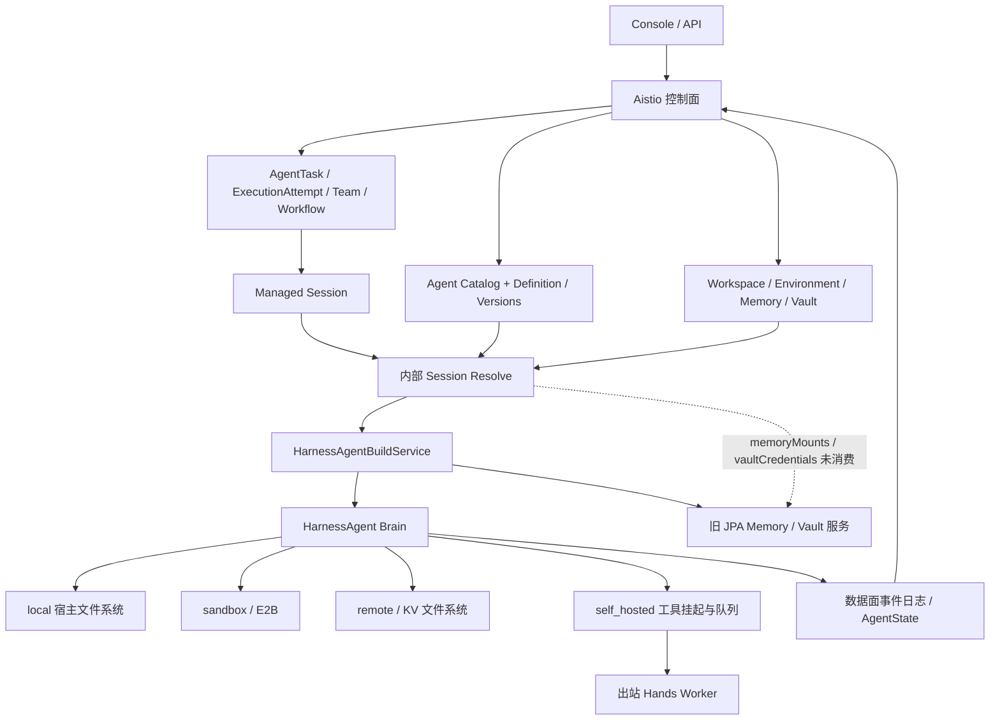

**Managed Agent 整体设计与实现审查（2026-09-08）**

后续改造与验证见 [实施记录](managed-agent-implementation-2026-09-08.md)。本报告保留审查时的状态，不能将其中已修复的问题视为当前实现结论。

结论：平台已经形成托管 Harness、持久化 Session、工具审批、Hands Worker、AgentTask/Team 协作的主干；Workspace、Environment、Memory、Vault 也都有产品资源和控制台入口。但“资源创建与绑定”到“运行时实际生效”的完成度明显不均衡。当前最需要投入的是跨层整合、配置语义、执行边界和可复现发布，随后才是增加更多 Harness 配置项。

审查位置为 `/Users/ken/agentscope-2/agentscope-java`，分支 `agentscope-service-v5`，开始审查时 HEAD 为 `5ae7920b6`。以包含已有暂存及未提交改动的工作区为准。本轮没有修改生产源码、提交代码、重启或部署服务，也没有调用真实模型或对现有 Agent 下发任务。新增本报告；现有改动保持原状。

证据包括当前源码、正在运行的本地控制台 `http://localhost:18080`、本地 PostgreSQL 的只读结构与计数查询、当前相关源码的无模型 Java 构建探针、Go product 包测试，以及 Anthropic 官方产品文档。不是完整生产验收；没有实测 E2B 云端会话、真实 MCP OAuth、跨节点故障恢复或并发 Memory 写入。

**1. 产品定位与架构判断。**

Claude Managed Agents 的关键抽象是将 Agent 定义、持久化 Session、托管 Harness、执行 Sandbox 分开，Harness 可恢复，Sandbox 可替换，凭证不应随不可信执行环境一起暴露。这里用 AgentScope HarnessAgent 承担 Brain 是合理的，平台层需要维护这些稳定契约，并把 Harness 的具体实现封装在数据面内。[Anthropic 架构说明](https://www.anthropic.com/engineering/managed-agents)

当前实际链路如下，图中的虚线关联表示本轮确认的资源解析断点。



平台还有一层比基础 Managed Agent 更丰富的 Agent Catalog、运行绑定、Issue/AgentTask/ExecutionAttempt、Team/Workflow。它与 Harness 内部 subagents 是两个层次：前者是平台工作调度与治理，后者是一个 Brain 内的委派能力。两者都应保留，但不能把 Team 成功执行当成 Harness subagent 配置与资源继承已经通过验收。

源码确认已有物理 turn 租约与 fencing、Attempt 上下文隔离及心跳、持久化事件、工具结果续跑、跨副本 interrupt 请求通道、统一审批等机制。旧文档里“跨副本 interrupt 尚不支持”等描述已经落后于当前实现，不应直接沿用为缺口。相关实现见 [SessionTurnRunner](/Users/ken/agentscope-2/agentscope-java/agentscope-service/service-dataplane/src/main/java/io/agentscope/builder/web/managed/SessionTurnRunner.java:168)。

**2. 完成度按实际链路评估，不使用缺少验收基准的百分比。**

| 能力 | 已实现 | 当前判断 | 主要短板 |
| --- | --- | --- | --- |
| 托管 Brain | Agent 版本解析、模型选择、Harness 构建、状态存储、事件流 | 主干成型 | 恢复契约、资源编译与缓存版本还需统一 |
| Agent 定义 | system/model/maxIters/tools/MCP/skills/Workspace/默认资源、版本 | 基础较完整 | Harness 配置覆盖有限；保存字段不等于构建消费 |
| Workspace 管理 | AGENTS.md、skills、tools/MCP、subagents、Marketplace、关联 Agent | 产品入口较完整 | 文件快照、同步删除、跨节点物化、发布语义 |
| Environment | local/sandbox/remote/self_hosted 适配，Worker 协议 | 类型适配已有 | 类型白名单、禁止降级、模板校验、配置 revision、Worker 接入流程 |
| Memory | Store/文档/历史版本/归档/Redact、默认及 Session 绑定 | 管理有实现，运行整合未闭合 | CP 与旧 DP 存储断开；原生 Harness memory 与 Store 分离 |
| Vault | 加密写入、仅回显元数据、凭证管理、绑定 | 管理有实现，运行整合未闭合 | CP 解析未消费；凭证作用域、轮换、target 语义 |
| Skills | 编辑、安装、附件资源、DefinitionStore repository、动态加载 | 部分链路成立 | 真正版本固定、删除传播、Worker 同源下载与筛选 |
| Harness subagents | 声明、动态发现、同步/后台任务、独立状态、共享或独立 workspace | 内核丰富，平台整合不足 | 沙箱继承、最终工具权限、资源继承、可见性 |
| 平台任务协作 | Managed Agent 接入 Task/Attempt/Issue/Team/Workflow | 已有实质实现 | 不应与内部 subagent 的生命周期混用 |
| 运维与发布 | SSE、事件持久化、租约、状态/审批页、部分 Worker 信息 | 基础可用 | 资源健康、跨面重投递、版本指纹、预算与发布验证 |

当前现场可见 Memory `demo`、Workspace `demo`、local 与 self_hosted Environment；Worker 状态显示 none。该现场没有运行中的出站 Worker，不能将 self_hosted 的协议实现等同于当前环境已就绪。

**3. 最先处理的断点：Memory/Vault 没有完成控制面迁移后的运行接线。**

控制面使用 `cp.memory_stores / cp.memories / cp.vaults / cp.vault_credentials`，Session resolve 已返回 `memoryMounts` 与 `vaultCredentials`。Java `SessionResolveResult` 声明了这两个字段，但在数据面源码中没有找到消费它们的调用。`HarnessAgentBuildService` 实际仍注入 `MemoryMountService`、`VaultCredentialResolver`，后者调用旧 JPA 服务与 repository，读取 `dp.builder_memory_store / dp.builder_vault*`。

只读查询当前运行库得到：

| 表 | 条目数 |
| --- | ---: |
| cp.memory_stores | 1 |
| dp.builder_memory_store | 0 |
| cp.vaults | 0 |
| dp.builder_vault | 0 |

Memory 的现场数据分离已确认；Vault 的断点由源码和表结构确认，现场没有真实凭证供端到端验证。查不到 Memory/Vault 时当前代码主要记录 warning 并继续，因而容易形成“UI 已绑定，Agent 没有真正获得资源”的体验。

关键证据：[控制面解析](/Users/ken/agentscope-2/agentscope-java/agentscope-service/aistio/internal/product/handlers_internal.go:94)、[构建时资源调用](/Users/ken/agentscope-2/agentscope-java/agentscope-service/service-dataplane/src/main/java/io/agentscope/builder/web/catalog/HarnessAgentBuildService.java:490)、[Memory 挂载](/Users/ken/agentscope-2/agentscope-java/agentscope-service/service-dataplane/src/main/java/io/agentscope/builder/web/managed/MemoryMountService.java:91)、[DP schema 配置](/Users/ken/agentscope-2/agentscope-java/agentscope-service/service-dataplane/src/main/resources/application.yml:9)。

建议将运行读取/写入统一到明确的资源服务契约：Memory 以授权的远程 backend 实现 filesystem route；Vault 以短期 credential binding 或代理执行接入 MCP。显式要求的资源挂载失败应让 admission/preflight 失败，或以结构化 degradation 明确告知用户，不能静默省略。

补接之前必须补授权校验。当前创建/更新 Session 校验 Environment，但没有同等验证 Memory/Vault 引用；`buildMemoryMount` 按 storeId 读取，没有接收 owner/session 授权主体。直接开始消费现有 mounts payload 会把现在的功能断点变成权限边界问题。应统一定义操作者、Agent owner、Session owner、执行身份以及每项资源 grant。

**4. Workspace：需要从可编辑文件集合升级为可发布的定义包。**

优点是已经将 Workspace 做成一等资源，能被多个 Agent 关联，AGENTS.md、skills、MCP/tools 与 subagents 有统一编辑入口。Agent 侧关联后提示去 Workspace 维护，方向正确。

当前至少有四个版本/物化问题：

1. Agent 版本 snapshot 不包含完整的 Workspace 文件快照。resolve 按 Session 版本读取 Agent snapshot，却按当前 Agent 的 `resolveDefinitionScope()` 读取当前 Workspace 文件。旧 Agent 版本可能混用新 skills/subagents，连切换 Workspace 后的定义来源也可能变化。
2. `syncDefinitionFilesFromResolve` 只 put 当前文件，不删除已经移除的文件；DefinitionStore 的 namespace 是 owner/agent，没有定义 revision。删除 skill 后的残留，以及不同版本实例之间的覆盖，都需要处理。
3. DefinitionStore 已供 skills 加载，但 AGENTS.md、subagents 和一般定义文件仍有本地磁盘读取/回退路径。控制面写文件时顺便镜像本地盘，同机开发可以掩盖部署到另一台 Brain 后文件不存在的问题；不能把返回 workspacePath 当成跨节点交付文件内容。
4. `rematerializeLinkedAgents` 的覆盖语义不一致：tools/MCP/skills 直接刷新，system 仅在原来为空时填充。创建时复制的 AGENTS.md 会变成非空 system，之后改 AGENTS.md 不会同步替换这个副本；Harness 又会加载 Workspace 上下文，可能同时带着旧 system 和新文件内容。刷新 Agent、写版本记录也没有组成统一事务与 CAS。

关键证据：[当前文件解析](/Users/ken/agentscope-2/agentscope-java/agentscope-service/aistio/internal/product/handlers_internal.go:153)、[只追加同步](/Users/ken/agentscope-2/agentscope-java/agentscope-service/service-dataplane/src/main/java/io/agentscope/builder/web/catalog/HarnessAgentBuildService.java:568)、[关联刷新](/Users/ken/agentscope-2/agentscope-java/agentscope-service/aistio/internal/product/handlers_workspaces.go:144)。

建议定义不可变 `WorkspaceRevision`，固定 AGENTS.md、skill/subagent 定义、MCP 声明和文件 manifest/hash；AgentRevision 明确引用它。把“随 Workspace 更新”和“固定版本”作为显式策略，草稿修改不会隐式改变已发布版本。物化过程必须可校验完整性、可同步删除、可在无共享盘的新节点重建。

还需区分三个含义：可复用的定义 Workspace、Session 的运行文件空间、平台租户/项目的权限空间。当前不同资源/模块都使用 workspace 一词，不能依靠一个磁盘 path 同时承担这三种职责。

**5. Environment：有适配层，还缺可验证的执行契约。**

local 是宿主文件系统，sandbox 对应 E2B，remote 对应 KV 文件系统，self_hosted 将 shell/文件工具变为 schema-only 工具，通过 Worker 执行结果续跑。这部分不是空壳。

已确认的高优先问题是：控制面创建 Environment 没有类型白名单，只对精确的 local 类型应用部署策略；Java 对未知 type 走 default local。无模型探针已确认 `typo-type` 会选择 LocalFilesystemSpec。组合这两段代码，未知类型可能绕过“禁止新建 local”策略。remote 缺少分布式 backend 时还会 warning 后退回 local。部署策略应由运行时再次强制，不允许执行边界静默降级。

E2B 适配支持 templateId、timeout、workspaceRoot、持久化模式等，但 packages/networking 等配置明确只记录未强制执行的 warning。未支持字段应被拒绝，或由 capability 明确标记；不能让保存成功暗示网络策略已经生效。

控制台目前创建时只有 name/type，创建后编辑原始 JSON。后端在创建时一次性返回 Worker key，前端类型未声明该 key、创建函数也未把返回结果交给展示流程；虽然后端有 rotate-key，页面没有对应操作。self_hosted 的说明仍提及内置进程内 Worker 自动处理，与当前出站 Worker 模式不一致。

Environment config 可修改，但 Harness 缓存 key 主要含 environmentId，不含配置 revision/digest。修改 E2B 模板、内存访问模式等后，现有缓存实例可能沿用旧配置，新实例采用新配置，缺乏明确的生效时点。

建议提供各环境类型的表单与 schema、启动预检、连接诊断、Worker 注册命令和 key 展示/轮换、环境能力矩阵、健康状态和 revision。Session 应固定 EnvironmentRevision，并展示最终解析结果；是否允许切换应在 turn 边界定义清楚。

证据：[CP 创建](/Users/ken/agentscope-2/agentscope-java/agentscope-service/aistio/internal/product/handlers_env.go:110)、[运行时类型映射及降级](/Users/ken/agentscope-2/agentscope-java/agentscope-service/service-dataplane/src/main/java/io/agentscope/builder/web/managed/EnvironmentSpecFactory.java:81)、[前端创建流程](/Users/ken/agentscope-2/agentscope-java/agentscope-service/frontend/src/pages/EnvironmentsHubPage.tsx:106)。

**6. Memory：不只是把 Store 挂上去，还要统一 Agent 的记忆行为。**

当前 Store 已有路径文档、版本、归档/删除和 Redact。旧运行 backend 也有写穿 MemoryStoreFilesystem 和只读配置，值得保留其接口思路。但存在多套记忆：Session 对话/AgentState、Harness `MEMORY.md` 与 `memory/*.md`、平台 Memory Store。

Harness `memory_search` 明确搜索 `MEMORY.md` 和 `memory/*.md`，平台 Store route 则为 `memory-stores/{name}/`。即使修复 CP 接线，这两套路径也不会自动合并，记忆 flush/consolidation 不会因 Session 挂了 Store 就自然写入它。

此外，Java filesystem route 只拦截文件工具，`RoutedSandboxFilesystem.execute` 仍直接进入沙箱 shell。因此 `read_file(memory-stores/...)` 与 shell 中读取同一路径不保证是同一份数据。self_hosted 文件工具在 Worker 执行，本轮没有找到 Store 下载/冲突处理/写回循环。Claude 官方当前分别为云沙箱和 self-hosted 明确了 live mount 或 Worker 同步语义，并支持挂载访问模式和写入归因，可借鉴其契约。[官方 Memory 文档](https://platform.claude.com/docs/en/managed-agents/memory)

应补齐：Session 级 mount path/access/instructions、同名及中文名称 slug 冲突处理、memory tool 与 Store 的检索/写入范围、用户/Agent/项目记忆分层、写入来源 session/agent/turn、CAS/冲突返回、历史比较与恢复、留存及导入导出。当前 CP `putMemory` 的 head 更新和历史版本写入分开执行、历史写入错误被忽略，尚不能作为可靠的并发审计记录。

证据：[原生 memory_search](/Users/ken/agentscope-2/agentscope-java/agentscope-harness/src/main/java/io/agentscope/harness/agent/tool/MemorySearchTool.java:29)、[Memory CP 写入](/Users/ken/agentscope-2/agentscope-java/agentscope-service/aistio/internal/product/handlers_memory.go:312)、[shell 直接委派](/Users/ken/agentscope-2/agentscope-java/agentscope-harness/src/main/java/io/agentscope/harness/agent/filesystem/RoutedSandboxFilesystem.java:63)。

**7. Vault：目前更接近凭证仓库与字符串替换，需要升级为受控凭证使用。**

正面能力是加密存储、写入后只显示元数据、归档/删除和 Agent/Session 绑定。除第 3 节的断点外，旧 resolver 将多个 Vault 的秘密展平，合并到 MCP server env；没有精确声明每个 server 可使用哪一个 credential。`target` 在 UI 示例中像 hostname，在 resolver 中又可能代表环境变量名或 MCP server name，语义不统一。

resolver 对未解析变量还会回退 `System.getenv`；OAuth 只做 access_token 注入，没有自动 refresh。凭证在 build 时解析，缓存 key 只含 Vault ID，轮换/撤销不会自然导致旧 MCP 客户端刷新。JSON 序列化后的整串替换也需要改为字段级替换，避免带引号或反斜线的 secret 破坏结构。

建议使用显式 `credentialRef + server/tool scope + 注入方式`，以调用时解析、短期凭证或 MCP proxy 支持轮换与撤销；区分平台基础设施凭证和用户授权凭证，禁止任意引用宿主环境变量，记录脱敏使用审计。stdio MCP 在 Brain 进程侧执行，也必须纳入信任边界，不能仅因为 shell 工具被外化就认为所有不可信代码都在 Hands。

这与 Claude 通过外部 Vault/MCP proxy 控制凭证使用的设计目标一致，但实现方式可以保留 AgentScope 自身架构。[官方 Vault 文档](https://platform.claude.com/docs/en/managed-agents/vaults)

证据：[Vault resolver](/Users/ken/agentscope-2/agentscope-java/agentscope-service/service-dataplane/src/main/java/io/agentscope/builder/web/managed/VaultCredentialResolver.java:65)、[跨 MCP 注入](/Users/ken/agentscope-2/agentscope-java/agentscope-service/service-dataplane/src/main/java/io/agentscope/builder/web/managed/VaultCredentialResolver.java:203)。

**8. HarnessAgent 定义能力：内核与平台暴露面之间有明显落差。**

| Harness 能力 | 平台现状 | 建议 |
| --- | --- | --- |
| 模型、system、maxIters | 已映射 | 增加模型可用性与运行预检 |
| GenerateOptions、模型/工具超时、重试、fallback | Builder 有能力，ManagedDefinition 缺对应完整字段 | 形成受控 execution/model profile |
| workspace 上下文、additionalContextFiles、maxContextTokens | 平台主要传 workspacePath | 明确定义来源与上下文预算 |
| compaction、tool result eviction、memory flush/consolidation | 主要依赖内核默认 | 给出可解释的 profile，并显示实际采用策略 |
| Plan Mode | 内核支持，Managed 构建未启用该能力 | 与审批/恢复统一后开放 |
| skills repository、动态加载、skill filter | 已接部分 | 版本/hash、作用域、禁用语义、来源与验证状态 |
| skill_manage、promotion gate、curator | 内核有选配能力，平台缺发布闭环 | 作为审核后的演进能力，不能直接修改已发布定义 |
| subagent declaration、remote、权限继承、skills、持久化、可见性 | UI 主要暴露描述/模型/maxIters/tools/workspace/body | 增加角色级权限和资源继承配置 |
| multiagent 字段 | CP/DTO 存储，Managed 构建未消费 snapshot.multiagent | 要么实现明确契约，要么明确拒绝/标注 |

公开 Agent 定义应是稳定、可校验的产品 schema；不必将所有 Java Builder 方法逐个搬到 UI。建议由一个定义编译步骤输出 EffectiveAgentSpec，把系统默认、Workspace、Agent、Session override、环境能力和授权求交后再构建 Brain。[Claude Agent 定义参考](https://platform.claude.com/docs/en/managed-agents/agent-setup)

**9. Skills 与 subagents 要分别验收，不能只看“创建成功”。**

Skills 正常路径已有 `DefinitionStoreSkillRepository`，支持 SKILL.md 与辅助资源，Harness 有动态加载和 staging。问题是 SkillRef.version 没被用于固定内容；空列表时未调用 enableSkills，而内核默认仍可能加载可用 repository 的全部 skills，需明确“未设置”“全部”“空集合”的区别。删除同步及多版本共用 DefinitionStore 会加剧这种歧义。

self_hosted 的 `SkillsBundleService` 仍读取旧 UserAgentDefinitionStore，并按 `resolveAgentWorkspace` 的默认 agent path 找磁盘 skills，没有以当前 session resolve 的 Workspace/definitionFiles/已选择 skills 为权威来源。Brain 与 Worker 可能拿到不同 skill 集合。修复应以同一份 resolved manifest 给两者分发，包含脚本资源、hash、版本和执行路径。

subagents 的 UI 已支持 inline 定义和 shared/isolated workspace；“从已有 Agent 添加”实际主要复制描述、system、model、maxIters，没有完整引用源 Agent 的 tools/MCP/skills/Environment/Memory/Vault/版本，不等同于复用已发布 Agent 的全部能力。

更关键的是执行约束：本轮无模型探针为父 Builder 设置了 sandbox spec，再走真实 declared subagent factory；isolated 子 Agent 被构建为 `ShellAwareOverlay`，没有得到隔离沙箱 spec。同时 `tools=[read_file]` 仍暴露 execute。后者在内核注释中的语义本来就是“过滤继承工具，子 Builder 仍可注册本地工具”，但作为平台可配置权限很容易被理解为最终 allowlist。

这是已确认的构建与工具暴露结果，不等于已经实测命令逃逸：实际执行还受 Service middleware 与运行上下文影响。平台必须让 Environment 能力与权限在父子链上单调收窄，隔离子 workspace 不能自动变更执行后端；最终注册工具集合要经过统一策略过滤。还需定义继承/禁止的 Memory、Vault、MCP、skills，以及后台子任务的事件归因、取消、重启续跑与预算。

证据：[子 Agent 构建分支](/Users/ken/agentscope-2/agentscope-java/agentscope-harness/src/main/java/io/agentscope/harness/agent/HarnessAgentBuilderSupport.java:392)、[Worker skill 来源](/Users/ken/agentscope-2/agentscope-java/agentscope-service/service-dataplane/src/main/java/io/agentscope/builder/web/managed/selfhosted/SkillsBundleService.java:59)、[从 Agent 复制](/Users/ken/agentscope-2/agentscope-java/agentscope-service/aistio/internal/product/handlers_workspace.go:556)。

**10. 工具集策略也需要统一编译。**

`AgentSpecCodec.toToolsConfig` 仅根据显式 configs 构造 allow/deny；当 agent_toolset 的 defaultConfig.enabled=false 且没有 configs 时，两个集合仍为空，ToolFilter 的空集合语义是保留全部工具。无模型探针已确认 execute 仍被允许。MCP toolset 的 enable/permission 配置也未在 codec/Service policy resolver 中得到与 agent_toolset 对等的解释。

已有 `ToolConfirmationMiddleware` 对 always_ask/deny 和策略读取失败做了处理，是应保留的基础。要补的是配置完整语义和最终工具集合校验：`enabled` 决定可用性，`permissionPolicy` 决定调用授权，两者不能替代；平台内部工具的例外也必须是显式、有限的。建议建立覆盖默认 allow/deny、空集合、逐工具覆盖、MCP、父子 Agent 的策略真值表。

证据：[AgentSpecCodec](/Users/ken/agentscope-2/agentscope-java/agentscope-service/service-common/src/main/java/io/agentscope/builder/web/catalog/spec/AgentSpecCodec.java:52)、[ToolFilter 空集合语义](/Users/ken/agentscope-2/agentscope-java/agentscope-harness/src/main/java/io/agentscope/harness/agent/tools/ToolFilter.java:31)、[Service 审批策略](/Users/ken/agentscope-2/agentscope-java/agentscope-service/service-dataplane/src/main/java/io/agentscope/builder/web/toolbus/ToolConfirmationMiddleware.java:199)。

**11. 其他影响托管完整性的事项。**

资源文件方面，控制面已能把 fileId 展开为内容，但 self-hosted `SessionInputStager` 主要消费 url/path/uri，并未处理展开后的 inline content；Git resource 在 Brain 本地 git clone 且失败只 warning；文件 resource 又以 owner/agent 写入 DefinitionStore，不是 session namespace。应提供统一的 SessionInput/Output/Artifact 契约，按执行环境物化，隔离不同会话的输入，明确私有 Git 授权、commit 固定、二进制与大文件支持。

事件方面，DP 先持久化再向 CP mirror 是合理起点，但 `appendTurnEvent` 与通用 SessionEventLog mirror 失败后主要记录 warning，没有在该链路看到持久化待发送记录和重放确认。DP 权威事件存在，不等于 CP 的 Chat/Task 读模型一定补齐。需要 durable outbox/reconciliation，并保留事件原有 Attempt fence。

恢复方面，当前 AgentState 存储、工具挂起和租约并不是零实现；但“新 Brain 可仅凭稳定资源与持久化状态继续”仍应通过崩溃点矩阵证明，包括模型响应后、工具副作用后、结果落库前、审批中、Worker 回传时。还应明确 EventLog 与 AgentState 的权威关系，而不是笼统承诺事件存在即能重放所有执行。

运营方面，目前 maxIters 不是全 Session 或子任务树的预算。需要总 token/时间/工具次数、子 Agent 并发上限、费用/消耗可见性，以及超限后的可恢复停止语义。Claude 已提供单独 Session budgets，可作为产品契约参考。[官方预算文档](https://platform.claude.com/docs/en/managed-agents/budgets)

控制台应增加“实际生效配置与依赖健康”：Agent/Workspace/Environment revision、选中与实际加载的 skills/subagents、MCP 连通性、凭证匹配结果、Memory mount/access、Worker 状态、配置不支持原因。当前主要是 CRUD 和 JSON 编辑，很多错误要到首次 turn 才暴露。

现场曾遇到一次 Workspace 页面动态 chunk 加载失败，刷新后恢复，符合当前前端资源正在更新时的旧入口/新资源不一致现象。记录为发布原子性和 lazy-load error recovery 的改进项，不据此判断 Workspace 页面持续不可用。

**12. 推荐优先级与交付切片。**

| 优先级 | 事项 | 可检查的完成标准 |
| --- | --- | --- |
| P0 | Environment 类型白名单及运行时禁止 local 降级 | 未知 type 被拒绝；禁用 local 时任何入口/子 Agent 均不能获得本地执行后端 |
| P0 | 最终工具权限、子 Agent 沙箱与授权继承 | default disabled、只读子角色、MCP 策略均经真实注册工具集合验证；子 Agent 不扩大执行边界 |
| P1 发布阻断 | Memory/Vault CP→DP 接线与授权 | Console 创建资源后运行时真实读写/使用；跨主体引用被拒绝；失败对用户可见 |
| P1 | 不可变 WorkspaceRevision + EffectiveAgentSpec | 同一 Agent revision 在新节点解析出相同文件 hash、工具、skills/subagents 和资源要求 |
| P1 | Worker 的 skills/inputs/memory 同源物化 | 无共享盘 Worker 能得到固定内容，修改能按契约写回，取消/重试无旧结果污染 |
| P1 | Credential binding、轮换/撤销、移除宿主 env fallback | 每个 MCP 仅获得声明凭证；轮换后采用新凭证，撤销后旧实例不能继续使用 |
| P1 | Environment/config revision 与缓存生效语义 | UI 可看到已运行/将运行版本，节点重启不导致无提示配置变化 |
| P1 | 事件 mirror 重投递与恢复矩阵 | CP 临时故障恢复后事件/消息/状态补齐，重复投递幂等且保留 fence |
| P2 | Harness profile 产品化 | 模型参数、超时/重试、Plan Mode、压缩和 memory 行为有统一 schema 与 UI |
| P2 | 资源可观测性、引用影响、Memory 历史/冲突处理 | 每项绑定可诊断、可追溯；并发写不会丢失历史或静默覆盖 |
| P2 | 总预算、子任务树、Artifact、发布验证 | Agent 发布前可以完成独立验收，运行消耗和子任务结果可追踪 |

第一批建议完成“执行边界与策略修正”，第二批完成“资源协议与定义发布”，第三批完成“Worker 与多副本一致性”，第四批再扩充“低代码配置与运营体验”。先统一 EffectiveAgentSpec 可以避免每个页面、Session 创建、任务调度和 Worker 再各自解释一遍同一份配置。

建议固定一组集成验收场景：Console 创建一个带 skill/脚本/subagent 的 Workspace，发布固定版本 Agent，绑定 Environment、只读知识 Store、可写工作 Store 和受限 MCP credential；分别在 local、E2B、全新 self-hosted Worker 上执行。检查实际上下文、工具集合、文件 hash、Store 读写、MCP 权限与凭证轮换，并对 Workspace 改版/删除、双 Session 并发、Brain 崩溃与 CP 短时中断做重复验收。此矩阵比继续增加孤立 CRUD 测试更能衡量 Managed Agent 完整度。

**13. 本轮验证记录与边界。**

- 控制台只读查看：Memory、Environment、Workspace 列表及 Workspace 定义页面；未创建、编辑或删除产品资源。
- 数据库只读查看：CP/DP Memory/Vault 表结构和计数；没有读取或输出凭证明文。
- `go test ./internal/product -count=1`：通过。未配置测试 PostgreSQL DSN，需 DSN 的用例按其现有逻辑跳过；本结果不代表跨 CP/DP 资源挂载已测试通过。
- 临时 Java 探针重新编译当前 `HarnessAgentBuilderSupport`、`AgentSpecCodec`、`EnvironmentSpecFactory`，复用现有依赖产物；无模型调用，无工具执行，无云端 sandbox 创建。最终运行退出码 0。

```text
AUDIT default_enabled_false_allows_execute=true
AUDIT unknown_environment_selects_local=true
AUDIT parent_has_sandbox_spec=true
AUDIT isolated_child_of_sandbox_backend_fs=ShellAwareOverlay
AUDIT child_read_only_tool_allowlist_exposes_execute=true
AUDIT selfhosted_child_has_read_file=true
```

最后一项是正向检查：self_hosted 子 Agent 保留 schema-only read_file，不能将“所有外化工具都没有继承”列为缺陷。需要继续验收的是挂起/续跑的 Session 身份、完整资源与策略继承。

探针保存在 `/var/folders/b3/0cr5wc6n1rq5r7x3ts0xvt1c0000gn/T/managed-agent-audit-kvh74u9y/`。没有执行全量 Maven 构建或部署；本报告是设计与实现审查结果，不是生产可用性认证。

**14. 补充审查：MCP Connector 与生产工具系统接入。**

判断：MCP 协议调用已实现，但 Managed Agents 的连接管理、会话身份、权限和网络执行位置尚未形成完整契约。不能把问题概括为“完全没有 MCP”；也不能把 Agent 中能填写 MCP URL 等同于生产连接器已完成。

Claude 的 MCP connector 当前也通过 Agent 的 `mcp_servers` 声明服务，通过 Session 的 `vault_ids` 提供身份；并不要求存在名为 Connector 的独立 CRUD 资源。其明确约束包括 server 与 `mcp_toolset` 双向匹配、逐工具 enabled/permission_policy、默认 MCP 调用审批，以及带 server 身份和重试状态的连接/鉴权失败事件。连接失败不阻止 Session 创建，后续由调用方决定如何处理。[官方 MCP connector](https://platform.claude.com/docs/en/managed-agents/mcp-connector)

本项目的已实现部分及断点：

- Harness [McpServerRegistrar](/Users/ken/agentscope-2/agentscope-java/agentscope-harness/src/main/java/io/agentscope/harness/agent/tools/McpServerRegistrar.java:49) 已支持 stdio、SSE、Streamable HTTP、headers/env、超时和 enableTools。注册失败在此处捕获后记录日志，没有直接转换为 Managed Session 的结构化连接状态。
- Aistio 另有 [MCPServer CRD](/Users/ken/agentscope-2/agentscope-java/agentscope-service/aistio/api/v1alpha1/mcpserver_types.go:72)、CRUD、Secret header 引用、[远程工具发现 controller](/Users/ken/agentscope-2/agentscope-java/agentscope-service/aistio/internal/controller/mcpserver_controller.go:39) 和针对引用它的 K8s Agent 的配置推送。因此注册与发现并非从零开始。但当前 Managed product 路径保存 Agent/Workspace 内嵌 `mcpServers`，Java 按 snapshot 构建客户端；本次未找到这条链路解析该 CRD 引用的桥接实现。Aistio `connector` Go 包是运行实例到控制面的 ASDP 连接，不能当作外部工具连接器。
- [AgentSpecCodec](/Users/ken/agentscope-2/agentscope-java/agentscope-service/service-common/src/main/java/io/agentscope/builder/web/catalog/spec/AgentSpecCodec.java:52) 编译 tools 时只处理 agent_toolset；权限映射同样跳过 mcp_toolset。因此 Harness 自己的 enableTools 不等于平台 mcp_toolset 的逐工具开关和审批语义已生效。控制台 active tools 接口主要读取已保存配置，不能证明真实 tools/list 发现和连接健康。
- 第 3 节 CP Vault 到 DP 的断点直接影响 MCP 鉴权。[VaultCredentialResolver](/Users/ken/agentscope-2/agentscope-java/agentscope-service/service-dataplane/src/main/java/io/agentscope/builder/web/managed/VaultCredentialResolver.java:132) 也明确尚未自动管理 OAuth refresh。会话身份隔离、凭证目的地址绑定和运行中轮换都需要验收。Claude 的凭证管理包含可配置 refresh 和运行中定期重新解析，这是可对照的完善方向。[官方 Vault 文档](https://platform.claude.com/docs/en/managed-agents/vaults)
- MCP 客户端在 Brain 构建时创建；stdio 也走该进程的 transport。现有 [SelfHostedToolSchemas](/Users/ken/agentscope-2/agentscope-java/agentscope-service/service-dataplane/src/main/java/io/agentscope/builder/web/managed/selfhosted/SelfHostedToolSchemas.java:33) 外化的是 shell/文件工具，没有通用 MCP 转发。因此把 Hands Worker 部署进客户 VPC，不自动使托管 Brain 能访问该 VPC 的 MCP；sandbox 内安装 stdio 所需包，也不自动使 Brain 的 stdio transport 可以运行它。这是执行路径推导，未做真实内网连通性实验。

建议先补完整契约，再按企业复用需求提升为一等资源：

| 层次 | 建议职责 |
| --- | --- |
| Connector / Server definition | 服务端点、协议、认证方式、工具元数据、可选网络路径；可复用现有 MCPServer 的能力 |
| Connection | 租户或用户账号的具体授权、Vault credentialRef、作用域、健康和授权失效状态 |
| Agent binding | 引用连接或声明所需服务；固定工具集合、审批策略、是否为必要依赖；子 Agent 只能缩小授权 |
| Session resolution | 解析实际用户身份与授权，校验访问权，选择连接执行位置，将明确的契约传给 Brain |

Vault 负责凭证，Environment 负责执行环境与网络能力，Workspace 保存可复用声明，Connector 负责外部工具连接；这些边界需要明确。最小阶段可继续 Brain 直连可达的远程 MCP，不必先引入网关。企业内网阶段增加受控代理、出站桥接或 Worker MCP executor，并让工具发现和实际调用使用一致的身份与网络路径。

生产验收应覆盖：双用户身份隔离；MCP 只读授权；写工具审批；OAuth 过期与撤销；运行中轮换；不可达及恢复的结构化事件；内网连接；stdio 执行位置；工具列表变更；子 Agent 权限继承。连接重试与工具执行重试需要区分，不能对已产生副作用的调用盲目重试。当前建议把鉴权/权限/失败可见性列为生产接入前必须完成，独立资源控制台和私网路径按目标客户场景推进。
