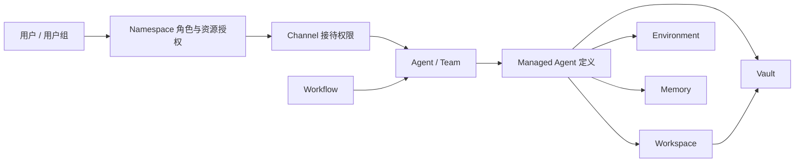

# Namespace 权限与配套资源管理

本轮实现日期：2026-09-09。工作目录为 `agentscope-service`，分支为 `agentscope-service-v5`。

本轮采用“账号持续可用”的前提，重点建设 Namespace、人员、资源、执行依赖和 IM 接待的权限管理。账号停用、离职交接不属于这次扩展范围。已有账号管理功能保持兼容。

## 1. 组织和权限模型

Namespace 是成员资格与资源归属的边界。一个用户可以通过直接角色分配、空间内的用户组获得成员资格；同时属于两个 Namespace 不代表可以混用它们的资源或业务数据。

- **User**：稳定的人类账号身份，负责请求和执行的归责。
- **User group**：Namespace 内的人员组；给多人统一分配空间角色和资源权限。与 Agent Team 分开管理。
- **Agent / Team / Workflow**：执行资源。Team 组织 Agent 协作，Workflow 组织节点与版本化执行过程。
- **Workspace / Environment / Memory / Vault / Model / MCP**：配套资源，具有独立的资源权限。
- **Channel**：IM 双向接待入口，把已识别用户的请求带入 Namespace，并将允许公开到该窗口的工作事件投递回去。
- **Issue / Chat / Run / AgentTask / Session**：业务记录与执行记录，继续应用原有私有内容、参与者与审计权限；有权管理资源不等于可以查看所有人的工作。

`Namespace.Roles(user)` 合并直接角色与用户组角色。删除组或移出组后，组带来的权限失效；其他直接授权和其他组的授权仍然存在。Namespace 所有者保留管理员、成员、开发者、运维角色；私有业务审计员仍需显式授予。

只有 Namespace 所有者或平台管理员能够改变有效 `auditor` 授权。此规则同时检查直接成员和用户组，普通空间管理员不能通过建组或把自己加入组来取得私有业务审计权限。

## 2. 资源动作与继承

每个资源以 `kind:id` 标识。资源策略存放在所属 Namespace 的 `resources` 中，不修改原有产品资源 owner 分区。

| 动作 | 用途 | 默认来源 |
| --- | --- | --- |
| `discover` | 在资源目录中发现名称、类型等必要信息 | Namespace 成员 |
| `use` | 调用执行资源或挂载配套资源 | member / developer / admin |
| `inspect` | 查看配置、定义或内容 | developer / admin |
| `edit` | 修改定义、配置或内容 | developer / admin |
| `publish` | 发布资源版本；配合 manage 配置 Workflow 模板导出 | developer / admin |
| `manage` | 管理该资源的授权 | Namespace admin 或显式资源管理授权 |

策略支持两种模式：

- `inherit`：保留 Namespace 默认角色权限，再合并直接与用户组资源授权。
- `restricted`：该资源只接受显式资源授权。Namespace 管理员始终保留 `manage`，方便恢复误配置；不会因此自动获得该资源的 use/inspect/edit。

任一显式资源授权均允许 discover；edit 包含 inspect。use 不包含 inspect，publish 不包含 use，manage 不直接包含资源内容权限。资源操作之外，创建 Issue 等工作入口还需要相应 Namespace 工作角色；资源授权不会绕过工作 ACL 或成员资格。

没有配置资源策略时，原有 Namespace 角色行为保持兼容。资源策略、用户组、申请记录复用 Namespace 的版本号和审计快照，修改使用 CAS，陈旧版本返回 409。

## 3. 依赖授权

资源目录提供正向依赖与反向引用关系，典型链路如下：

调用执行资源时，依赖必须满足以下之一：

1. 调用用户拥有依赖的 use；
2. 依赖资源的管理者已在 `consumers` 中批准当前父资源使用它。

例如，给 Vault 添加 `managed-agent:<id>` consumer，可以允许该 Agent 使用 Vault，而不让调用者浏览 Vault 凭据。consumer 授权只在明确的依赖边上生效，不能用来直接调用依赖。不存在的资源、跨 Namespace 引用、未经授权的替换依赖和依赖环会阻止执行。保存 consumer 前验证父资源确实引用当前依赖。

当前自动提取的依赖包括：Agent 的 Managed bindings；Team 的 leader 与有效成员；Workflow 的 Agent、Team 与嵌套已发布 Workflow；Managed 定义中的 Workspace、默认 Environment、Memory、Vault；Managed/Workspace MCP 配置中的 OAuth Vault；Channel 配置的接待目标。Model/MCP 资源自身可以单独授权；内联的模型名称或 MCP 连接配置不会被误解释成另一个 Namespace 中的命名资源。

HTTP 配置入口检查结构化依赖字段。运行前再次读取最新权限：AgentTask 按实际选择的 binding 校验，Team 按 Run 中的成员快照校验，Workflow 按已发布 revision 校验。动态派发到未包含在授权依赖链中的 Agent，需要它自己的 use 权限。后台派发和 HTTP 派发使用相同的 Resolver；配置了资源策略但没有授权回调的 Resolver 会拒绝派发。

新建和继续 Chat、Session 的消息执行、个人 Session 创建与修改也进行资源权限校验。历史聊天和工作记录仍按原有内容权限读取。SQL 资源列表在分页和统计前应用过滤；Kubernetes Model/MCP 列表按资源 inspect 过滤配置结果。

## 4. Channel 与 IM 窗口

Channel 的配置权限、发送者身份、窗口规则、目标资源和业务内容权限分别检查。

- 外部 sender 先配对到稳定用户账号；权限使用当前 Namespace 状态。
- 路由可开启 `restrictGroups`，并选择允许使用该窗口的人员组。
- 同一聊天中的线程规则优先于聊天级规则，不把两者的权限合并。开启限制但没有允许组时拒绝访问。
- 新工作创建前，校验发送者对接待 Agent/Team 及其依赖的使用权限。配置一个 Channel 不会自动给其使用者授予目标 Agent 的权限。
- 结果投递前，重新核对身份绑定、空间与 Channel 权限、窗口组规则、Issue 可见性、群组发布同意和订阅状态。权限撤回后，排队的内容投递被取消。
- 管理员配置组并不替用户批准工具执行；现有工具审批流程继续独立生效。

## 5. 跨 Namespace 复用

此次开放的是**已发布 Workflow 模板导入**：

1. 源资源管理者在 Workflow 授权页选择目标 Namespace；变更导出名单同时需要 publish。
2. 目标空间成员可以看到明确分享给本空间的已发布模板摘要。
3. 目标空间开发者导入时，为每个 Agent/Team 依赖选择有权使用的本地资源。
4. 服务端重新检查源 Namespace 版本与导出授权，清除节点的 runtimeCandidate，生成目标空间的本地草稿。
5. 草稿经目标空间自己的检查与发布后再执行。结果、Issue 和 Session 留在目标空间。

撤回源导出后不能继续导入；已经生成的本地草稿是独立副本。不会把源空间 Agent、运行凭据或 binding 直接授权给目标空间。当前不支持包含嵌套 Workflow 节点的模板导入，服务端明确返回错误；也不提供跨空间直接运行 Agent/Team 或共享 Vault 内容的能力。

## 6. 管理入口

| 入口 | 功能 |
| --- | --- |
| Access settings → Namespaces → 空间 → Members | 直接成员与空间角色 |
| 同一空间 → User groups | 创建人员组、统一分配角色、维护成员、移除组 |
| 同一空间 → Resources | 搜索资源，查看有效动作与依赖 |
| 资源 → Access & dependencies | 继承/限制模式、用户/组授权、依赖 consumer、权限来源、申请入口 |
| 同一空间 → Requests | 成员查看自己的申请，空间管理者批准或拒绝 |
| 同一空间 → Shared templates | 查看明确共享到本空间的模板，映射本地资源并导入 |
| 同一空间 → Access log | 查看角色、用户组、资源授权、consumer、导出与审批快照 |
| Users → 用户 → Namespace access | 查看直接角色及用户组来源，编辑直接授权 |
| Profile → My namespaces | 查看自己的有效角色与用户组，进入资源权限与申请页面 |
| Channel → Work 配置 → 路由 | 设置窗口允许的人员组 |

资源管理页可从 Namespace Resources 统一进入；Agent、Team、Workflow、Channel、Workspace 详情页提供快捷链接。Environment、Memory、Vault 等也可在统一目录中配置。

## 7. API 入口

以下路径均以 `/api/v1/namespaces/:namespaceName` 为前缀：

| 方法 / 路径 | 用途 |
| --- | --- |
| GET `/resources` | 资源目录 |
| GET / PUT `/resources/:kind/:resourceId/access` | 有效权限解释与策略更新 |
| GET / PUT `/groups` | 人员组列表与 CAS 更新 |
| GET / POST `/requests` | 申请列表与创建 |
| POST `/requests/:requestId/review` | 审批并原子写入直接资源授权 |
| GET `/shared-templates` | 获取分享给本空间的已发布模板摘要 |
| POST `/import-template` | 校验源版本、替换依赖、创建本地草稿 |

后端主要实现位于 `aistio/internal/httpapi/resource_*.go`、`controlplane/model/resource_access.go` 和 `product/resource_*.go`。前端位于 `frontend/src/features/settings`。不需要新建数据库表；现有 Namespace JSON 存储与审计表承载新字段。

## 8. 验收与运行状态

测试记录、截图与执行命令见 本轮验收报告（历史本地验收记录，保存在发布前备份中）。代码直接写在项目主目录的 `agentscope-service-v5` 分支；保留同目录已有修改。前端构建更新 `aistio/ui`，后端完成本地构建。未启动、重启或部署用户正在运行的服务。
