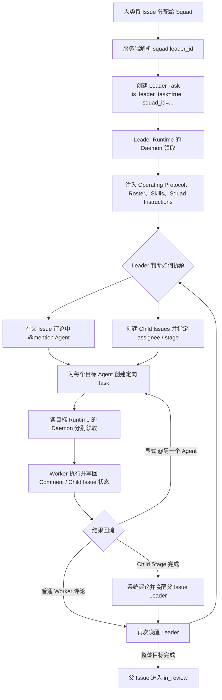

# Multica Squad / Agent Team 实现分析

> 分析日期：2026-09-02
> 分析对象：`/Users/ken/agentscope-2/multica`
> 使用目的：为 AgentScope Service 的 Agent Team、Issue-first 协作与任务路由设计提供参考
> 性质：源代码行为分析，不是 AgentScope Service 的现行 API 契约

## 1. 结论

Multica 中的 Agent Team 对应产品概念 **Squad**。它采用的是：

```text
固定 Leader
  + Issue / Comment 作为持久协作空间
  + Mention / Child Issue 作为委派方式
  + 定向 AgentTask 作为执行义务
  + Daemon / Runtime 作为任务领取与执行端
```

其核心不是“多个 Agent 从公共池中自由认领任务”，而是：

1. 人类把 Issue 分配给 Squad；
2. 服务端将 Squad 解析为固定的 `leader_id`；
3. Leader Agent 读取 Issue 和 Squad roster，决定如何拆解；
4. Leader 通过 `@mention` 或创建 Child Issue，把工作定向交给具体 Agent；
5. 服务端为每个目标 Agent 创建已经绑定 `agent_id`、`runtime_id` 的 Task；
6. 目标 Runtime 上的 Daemon 领取并执行 Task；
7. Worker 通过 Issue Comment 或 Child Issue 状态回传结果；
8. 平台再次唤醒 Leader，由 Leader 决定下一轮委派、升级给人类或结束协作。

因此，Multica Squad 更准确的定位是：

> 一个基于 Issue 的层级式 Actor 协作模型。Leader 是动态 planner/router，Issue 与 Comment 是共享事实和通信空间，AgentTask 是可靠执行义务，Daemon 是定向消费者。

## 2. 总体运行链路



## 3. Squad 的领域模型

Squad 不是一种特殊 Agent，也不拥有自己的 Runtime。它是一个持久的协作与路由对象。

核心字段可以概括为：

```text
squad
  id
  workspace_id
  name
  description
  instructions
  leader_id
  creator_id
  archived_at

squad_member
  squad_id
  member_type       # agent | member
  member_id
  role
```

字段语义：

- `leader_id` 必须指向一个 Agent，是所有 Squad 初始执行的真实目标。
- `member_type=agent` 表示可被委派并执行 AgentTask 的成员。
- `member_type=member` 表示人类成员；人类不会领取 AgentTask。
- `role` 只作为 Leader 的路由上下文，不自动产生权限、调度或执行语义。
- `instructions` 只注入 Leader briefing，不直接注入每个 Worker。
- 同一 Agent 可以加入多个 Squad，也可以同时担任其他 Squad 的 Leader。

源代码入口：

- `server/pkg/db/queries/squad.sql`
- `server/internal/handler/squad.go`
- `packages/core/types/squad.ts`

## 4. 谁负责拆解任务

### 4.1 Leader Agent 负责语义拆解

Multica 没有一个独立的确定性 Planner 服务，也没有服务端技能匹配算法。任务拆解和成员选择由 Leader Agent 的模型推理完成。

Leader 领取 Task 时，服务端追加三部分上下文：

1. **Squad Operating Protocol**
   - 要求 Leader 只做协调；
   - 阅读 Issue、评论和验收条件；
   - 根据成员 role 和 skills 选择成员；
   - 通过精确 Mention 委派；
   - 委派后停止本轮执行；
   - 每轮记录 evaluation；
   - 整体目标完成后才把父 Issue 推到 `in_review`。

2. **Squad Roster**
   - Leader 自身；
   - 未归档成员；
   - 成员类型；
   - role；
   - Agent 已挂载的 workspace skills；
   - 可直接复制的 Mention Markdown。

3. **Squad Instructions**
   - 用户配置的团队路由规则；
   - 升级策略；
   - 团队特有背景和协作约束。

对应实现：

- `server/internal/handler/squad_briefing.go`
- `server/internal/handler/daemon.go` 中的 Leader briefing 注入逻辑
- `server/internal/daemon/prompt.go` 中的 per-task Leader role 识别

### 4.2 Leader 身份是每个 Task 的角色

Leader 不是 Agent 的永久运行模式，而是 Task 上的角色：

```text
is_leader_task = true
squad_id = <squad-id>
```

同一个 Agent 可以：

- 在 Task A 中作为 Squad Leader；
- 在 Task B 中作为普通 Worker；
- 作为多个 Squad 的 Leader。

使用 `squad_id` 而不是通过 `leader_id` 反查 Squad，是因为一个 Agent 可能领导多个 Squad。Task 必须固定“本次代表哪个 Squad 行动”。

### 4.3 拆解质量主要是模型责任

以下行为由 prompt 约束，而不是服务端严格验证：

- 是否进行了合理拆解；
- 是否选中了技能最匹配的成员；
- 是否只给 Squad roster 中的成员派活；
- 是否真的只协调而没有亲自实现；
- 是否派活后立即停止；
- 是否在所有非 `no_action` 情况下正确回复。

服务端会做权限和目标可用性检查，但通用 `@agent` 路由不会强制验证目标一定属于当前 Squad。因此“只能派给 roster 成员”在 Multica 当前实现中主要是行为协议，不是数据库级或服务端级不变量。

## 5. Leader 如何把任务分出去

Multica 支持两种协作粒度。

### 5.1 方式一：同一 Issue 内通过 Mention 委派

Leader 在父 Issue 中发布评论：

```md
[@Frontend](mention://agent/<frontend-agent-id>) 负责前端实现。
[@Backend](mention://agent/<backend-agent-id>) 负责接口实现。
```

服务端行为：

1. 解析结构化 Mention；
2. 对每个目标执行 Access、归档状态和 Runtime 绑定检查；
3. 按实际执行 Agent ID 去重；
4. 为每个不同 Agent 创建一个 Task；
5. 把触发评论绑定为 `trigger_comment_id`；
6. Task 仍然关联同一个父 Issue。

适合：

- 工作较轻；
- 不需要独立生命周期；
- 多个 Agent 可以共享父 Issue 上下文；
- 结果通过同一讨论线程汇总。

显式 Mention 的路由优先级高于普通评论的 thread/assignee fallback。

对应实现：

- `server/internal/handler/comment.go`
- `server/internal/service/task.go::EnqueueTaskForMention`

### 5.2 方式二：创建 Child Issue

Leader 也可以把工作拆成独立 Child Issue，并给每个 Child Issue 设置负责人：

```bash
multica issue create \
  --title "实现 API" \
  --parent <parent-id> \
  --assignee <backend-agent> \
  --status todo
```

Child Issue 有自己的：

- title / description；
- assignee；
- status；
- comments；
- AgentTasks；
- result / artifact；
- stage。

适合：

- 工作需要独立验收；
- 需要单独追踪状态；
- 需要表达并行、串行或阶段依赖；
- 工作量较大，父 Issue 时间线不宜承载全部执行细节。

### 5.3 两种方式不能对同一工作重复使用

如果 Leader 创建了一个 `todo` Child Issue 并分配给 Agent，该 assignment 已经会触发 Agent。

如果同时又在父 Issue 中 `@mention` 同一个 Agent 处理同一工作，就会产生两条不同 Task：

```text
父 Issue Mention Task
Child Issue Assignment Task
```

因此 Operating Protocol 明确要求同一份工作二选一：

- 在父 Issue 内 Mention；或
- 创建已分配的 Child Issue。

## 6. 并行、串行与阶段屏障

### 6.1 并行

创建多个 `status=todo` 的 Child Issue，或者在一条评论中 Mention 多个 Agent，会立即创建多个 AgentTask。

不同 Agent 可以在同一父 Issue 上并行执行。

### 6.2 串行

后续步骤先创建为 `backlog`：

```text
Step 1 -> todo
Step 2 -> backlog
Step 3 -> backlog
```

当 Step 1 真正完成后，由 Leader 把 Step 2 推到 `todo`。从 `backlog` 离开会触发已分配 Agent。

### 6.3 Stage barrier

Child Issue 可以设置 `stage >= 1`：

```text
Stage 1: Research A, Research B    # todo，可并行
Stage 2: Build                     # backlog
Stage 3: Test                      # backlog
```

平台只负责检测：

> 当前最低未完成 Stage 中的所有 Child Issue 是否都已进入 `done` 或 `cancelled`。

当 barrier 闭合时：

1. 服务端在父 Issue 写入 system comment；
2. system comment 描述完成的 Stage 和后续提示；
3. 服务端显式唤醒父 Issue 的 Agent assignee 或 Squad Leader；
4. Leader 判断是否启动下一 Stage；
5. 服务端不会自动把所有后续 backlog Child Issue 推到 todo。

没有设置 stage 的所有 Child Issue 被视为一个隐式 Stage，因此只在最后一个 Child Issue 完成时唤醒父负责人一次。

对应实现：

- `server/internal/handler/issue_child_done.go`
- `server/migrations/123_issue_stage.up.sql`
- `server/internal/service/builtin_skills/multica-working-on-issues/SKILL.md`

## 7. Worker 如何把控制权交还给 Leader

### 7.1 普通 Worker 评论

当 Issue 的 assignee 是 Squad 时，Worker Agent 在该 Issue 上发布一条不含显式 Participant Mention 的评论，服务端会把它路由给当前 Squad Leader。

形成：

```text
Leader -> Worker -> Leader
```

Leader 被再次唤醒后可以：

- 继续派下一步；
- 让另一个 Agent 审核；
- 请求人类输入；
- 记录 `no_action` 并保持沉默；
- 确认整体目标完成并把父 Issue 推到 `in_review`。

### 7.2 显式 Mention

如果 Worker 评论明确 `@Agent B`，显式 Mention 被视为明确交接，优先路由给 B，而不是再走默认 Leader fallback。

Agent 作者的显式 `@agent` / `@squad` 可以触发 Agent-to-Agent 委派，但仍然受到调用权限与 originator/delegation lineage 约束。

### 7.3 Child Issue 完成

Child Issue 进入终态且关闭 Stage barrier 时，服务端只唤醒父 Issue 的负责人：

- 父负责人是 Agent：唤醒该 Agent；
- 父负责人是 Squad：只唤醒 Squad Leader；
- 父负责人是 Human：不创建 AgentTask。

平台不 fan-out 给整个 Squad，因为 Child 完成是一个协调信号，应该由 Leader 判断下一步。

## 8. Task 的投递与领取

### 8.1 Task 在创建时已经定向

AgentTask 创建时已经包含：

```text
agent_id
runtime_id
issue_id
priority
trigger_comment_id
is_leader_task
squad_id
originator / accountable / delegation lineage
```

因此不存在“Agent 看到公共任务池后竞争认领”的过程。

真实流程是：

```text
Leader 选择 Agent
  -> Server 创建目标明确的 AgentTask
  -> 目标 Agent 绑定 Runtime 的 Daemon 拉取
  -> Server 原子 claim
```

### 8.2 Claim 顺序

同一个 Agent 的可领取 Task 按以下顺序选择：

```text
priority DESC
created_at ASC
id ASC
```

数据库使用 `FOR UPDATE SKIP LOCKED` 避免并发 claim 冲突。

### 8.3 并发与串行约束

- 每个 Agent 受 `max_concurrent_tasks` 限制；
- 同一个 `issue + agent` 的 active Task 被串行化；
- 不同 Agent 可以并行处理同一 Issue；
- 同一 Agent 可以并行处理不同 Issue，但仍受自身并发上限控制；
- queued/dispatched 的重复触发通过唯一约束、合并和 deferred follow-up 收敛。

对应实现：

- `server/internal/service/task.go::ClaimTask`
- `server/internal/service/task.go::ClaimTaskForRuntime`
- `server/pkg/db/queries/agent.sql::ClaimAgentTask`

## 9. 评论路由与重复触发处理

### 9.1 路由优先级

评论路由可以概括为：

```text
显式 @agent / @squad
  > 回复的 Agent 作者
  > 当前 discussion/thread 的 Agent owner
  > Issue assignee fallback
```

补充规则：

- `/note` 不触发 Agent；
- `@all` 抑制隐式 Agent fallback；
- `@member` 不创建 AgentTask；
- Squad mention 只解析为 Leader，不 fan-out 给所有 Squad member；
- Squad Leader 自己的 Leader-role 评论不会再次唤醒自己；
- Worker-role Agent 的普通结果评论可以唤醒 Squad Leader。

### 9.2 已有 pending/running Task 时

Multica 不简单丢弃新评论：

- 目标 Task 仍在 queued 时，新评论合并进原 Task；
- 目标 Task 已经 dispatched/running 时，新评论登记为后续处理义务；
- 当前 Task 完成时执行 completion reconcile；
- 未实际交付给本轮 Agent 的评论会触发一个 bounded follow-up Task；
- 多条未处理评论最终合并为一次 follow-up，避免每条评论单独重跑。

这解决了“Agent 正在执行时用户又补充要求，评论不能静默丢失”的问题。

对应实现：

- `server/internal/handler/comment.go::resolveCommentTriggerEnqueue`
- `server/internal/handler/daemon.go::reconcileCommentsOnCompletion`
- `server/pkg/db/queries/task_message.sql`

## 10. Leader 的状态责任

Issue 状态和 AgentTask 状态是两套独立状态机。

```text
AgentTask completed
    !=
Issue done
```

对于真正分配给该 Squad 的父 Issue：

1. Leader 首次接单时将父 Issue 推到 `in_progress`；
2. Worker 执行期间父 Issue 保持 `in_progress`；
3. 成功派活不等于父 Issue 完成；
4. Leader 在后续重新唤醒时确认整体目标是否达成；
5. 达成后由 Leader 推到 `in_review`；
6. `done` 留给人类确认或既有集成，例如带 close intent 的 PR merge。

如果 Squad 只是被 `@squad` 邀请到另一个负责人拥有的 Issue，Leader 虽然仍获得 Squad roster 和委派规则，但没有修改该 Issue 状态的权限语义。

## 11. Leader Evaluation 与审计

Leader 每轮被要求调用：

```bash
multica squad activity <issue-id> action|no_action|failed --reason "..."
```

服务端将其写入统一 `activity_log`：

```text
action = squad_leader_evaluated
details = {
  squad_id,
  task_id,
  outcome,
  reason
}
```

接口会验证：

- Issue 当前确实分配给 Squad；
- 调用者是该 Squad 的 Leader Agent；
- `X-Task-ID` 对应当前 Issue；
- outcome 只能是 `action`、`no_action` 或 `failed`。

`no_action` evaluation 还用于抑制 Task 完成时平台自动生成无意义的 fallback Comment。

需要注意：Operating Protocol 把 evaluation 描述为 mandatory，但平台并没有把“缺少 evaluation”作为 Task 完成失败条件。因此它属于“有服务端校验的显式审计动作”，而不是严格的 Task 终态门禁。

对应实现：

- `server/internal/handler/squad.go::RecordSquadLeaderEvaluation`
- `server/internal/service/squad_no_action.go`
- `server/internal/service/task.go::CompleteTask`

## 12. 平台硬保证与 Prompt 软约束

### 12.1 平台硬保证

Multica 服务端真正保证的是：

- Squad 初始只路由到固定 Leader；
- Task 固定绑定 Agent 与 Runtime；
- Agent/Squad 调用权限检查；
- archived / missing runtime 的 fail-closed；
- Mention 解析与目标去重；
- 同一 `issue + agent` 的 pending/active 去重与串行化；
- 评论输入合并和 completion reconcile；
- Leader self-trigger 抑制；
- Child Stage barrier 检测；
- 父 Issue 负责人重新唤醒；
- Task、Comment、Activity 和 realtime event 的审计可见性。

### 12.2 Prompt 软约束

主要依赖模型遵守的是：

- Leader 是否正确理解目标；
- 是否合理拆解；
- 是否选择合适成员；
- 是否只派给 roster 成员；
- 是否避免亲自实现；
- 是否派活后停止；
- 是否及时升级给人类；
- 是否正确判断整体目标已达成。

这个边界非常重要：Multica 不是一个完全确定性的 workflow engine，而是一个“可靠控制面 + LLM 决策面”的组合。

## 13. 与 Matrix / 通用 Agent 协议的区别

Multica Squad 的协作主链路不是通用 Agent-to-Agent 消息协议。

```text
Agent A
  -> 写 Issue Comment + Mention
  -> Server 持久化并路由
  -> 创建 AgentTask
  -> Agent B 的 Runtime 执行
```

Agent A 和 Agent B 不直接维护对等连接，也没有依靠 Matrix room 进行动态发现和消息交换。

Multica 模型的特点：

- 集中式控制面；
- Issue-first；
- 消息、状态和执行义务分离；
- 所有协作可审计；
- Runtime 异构性由 Daemon adapter 消化；
- Agent 间可靠交接通过持久 Comment/Route/Task 表达。

Matrix 式模型更适合自治节点之间的寻址、联邦和实时通信；Multica 更适合业务任务管理、权限控制、可靠执行和人机共同审计。

## 14. 对 AgentScope Service 可直接复用的设计

### 14.1 建议保留的核心结构

```text
Team
  leaderAgentId
  members[]
  role / capability metadata
  typed policy
  instructions

Issue
  assigneeType = agent | team | human
  assigneeId
  parentIssueId
  stage

Comment
  author
  parent/thread
  structured mentions
  sourceTaskId

CommentRoute
  routeType
  target
  outcome
  task/input reference

AgentTask
  agentId
  teamId / teamRole
  triggerCommentId
  delegatedFromTaskId
  runtimeBinding snapshot
```

### 14.2 推荐运行语义

1. Team assignment / Team mention 永远先路由到 Leader；
2. Team member 不自动 fan-out；
3. Leader 通过 Mention 或 Child Issue 委派；
4. Mention 适合轻量协作，Child Issue 适合独立验收和阶段控制；
5. Task 在创建时绑定逻辑 Agent，不让 Worker 从公共池自由抢业务任务；
6. RuntimeBindingResolver 在 dispatch 时固定物理执行后端；
7. Worker result/progress 生成 follow-up route 唤醒 Leader；
8. Child Stage barrier 只负责唤醒，不自动做业务决策；
9. Task terminal 不自动等同 Issue terminal；
10. 所有路由必须产生 queued/coalesced/deferred/suppressed/blocked outcome；
11. running Task 期间到达的新输入必须进入 successor/follow-up，不能静默丢失；
12. Team 协作事实写 Issue/Comment/Activity，不写进 Session transcript 作为唯一事实源。

### 14.3 建议比 Multica 更强的地方

AgentScope Service 可以在借鉴 Multica 时，把部分 Prompt 软约束升级为平台策略：

- 服务端校验 Team Leader 只能委派给 Team member，除非 policy 明确允许外部协作；
- TeamPolicy 明确 fan-out、最大并发、最大 hop、最大 child depth/count；
- evaluation 成为可选的 Task completion gate，而不只是 prompt 要求；
- decomposition plan 可持久化为结构化记录，而不只存在于评论文本；
- Child dependency 使用结构化依赖或 typed stage policy；
- Leader 决定启动下一 Stage 时要求 CAS/version，避免并发重复推进；
- route、input、delivery receipt 和 successor obligation 全部结构化持久化；
- 明确区分 logical AgentTask 与 physical ExecutionAttempt；
- 每次跨 Agent 委派保存 accountable human 与 delegation lineage；
- 超预算、循环、权限拒绝和 dead-letter 必须进入 Human Inbox。

### 14.4 不建议照搬的部分

- 不要把精确 Markdown `mention://...` 当唯一写入协议；API 应使用结构化 mentions，Markdown 只作为显示或 CLI 兼容格式。
- 不要仅靠 Prompt 限制 Leader 的委派范围。
- 不要把“模型说完成了”直接当 Issue 完成事实。
- 不要把 Runtime 在线状态作为 Comment 是否能持久化的前置条件；Comment/Route/Task 应先持久化，再由可靠投递处理暂时离线。
- 不要让 Session transcript 取代 Issue discussion。
- 不要用 push/event 作为唯一执行义务；数据库 Task/Input 才是事实源。
- 不要建立 Team 专属的第二套消息与任务系统；Team 工作仍然应使用 Comment、AgentTask 和 Child Issue。

## 15. 一句话映射到 AgentScope Service

```text
Multica Squad                         AgentScope Service 建议映射
──────────────────────────────────   ──────────────────────────────────
Squad                                Team
Squad leader                         leaderAgentId
Squad roster / role / skills         TeamMember + role/capability
Squad Operating Protocol             Leader execution policy/brief
Issue assignee_type=squad            Issue assigneeType=team
Comment mention                      structured Mention + CommentRoute
agent_task_queue                     AgentTask
daemon claim                         RuntimeBindingResolver + ExecutionAttempt
child Issue                          Child Issue
issue.stage                          stage/dependency policy
squad activity                       Team leader evaluation Activity
worker comment wakes leader          follow-up CommentRoute
```

## 16. Multica 关键源码索引

| 主题 | Multica 源码路径 |
|---|---|
| Squad 数据访问 | `server/pkg/db/queries/squad.sql` |
| Squad CRUD、成员和 evaluation | `server/internal/handler/squad.go` |
| Leader Operating Protocol / Roster | `server/internal/handler/squad_briefing.go` |
| Issue assignment 解析为 Agent/Leader | `server/internal/service/issue_trigger.go` |
| Comment / Mention / fallback 路由 | `server/internal/handler/comment.go` |
| AgentTask 创建、领取、完成 | `server/internal/service/task.go` |
| Task claim SQL | `server/pkg/db/queries/agent.sql` |
| Claim 时注入 Leader briefing | `server/internal/handler/daemon.go` |
| Daemon 识别 per-task Leader role | `server/internal/daemon/prompt.go` |
| Child Issue stage barrier 和父级唤醒 | `server/internal/handler/issue_child_done.go` |
| Squad 产品文档 | `apps/docs/content/docs/squads.zh.mdx` |
| Comment Mention 产品文档 | `apps/docs/content/docs/mentioning-agents.zh.mdx` |
| Task 产品文档 | `apps/docs/content/docs/tasks.zh.mdx` |
| Agent 可见的 Squad 内置 skill | `server/internal/service/builtin_skills/multica-squads/SKILL.md` |
| Child Issue / Stage 内置 skill | `server/internal/service/builtin_skills/multica-working-on-issues/SKILL.md` |

## 17. 最终判断

Multica 的 Agent Team 机制没有引入一套独立的 Agent 消息网络，而是把成熟的 Issue 管理对象提升为 Agent 协作协议：

```text
Issue       = 长期目标与状态事实
Comment     = 持久协作消息
Mention     = 路由意图
Child Issue = 结构化任务拆解
AgentTask   = 对一个具体 Agent 的执行义务
Daemon      = 已定向任务的领取和执行者
Leader      = 基于上下文动态决策的 planner/router
```

它的价值不在于复杂的 Team runtime，而在于把模型负责的语义决策和平台负责的可靠性拆开：

- 模型决定“做什么、拆成什么、交给谁”；
- 平台保证“权限正确、目标明确、输入不丢、任务不重、结果可回流、过程可审计”。

这也是最适合 AgentScope Service 复用的设计边界。
