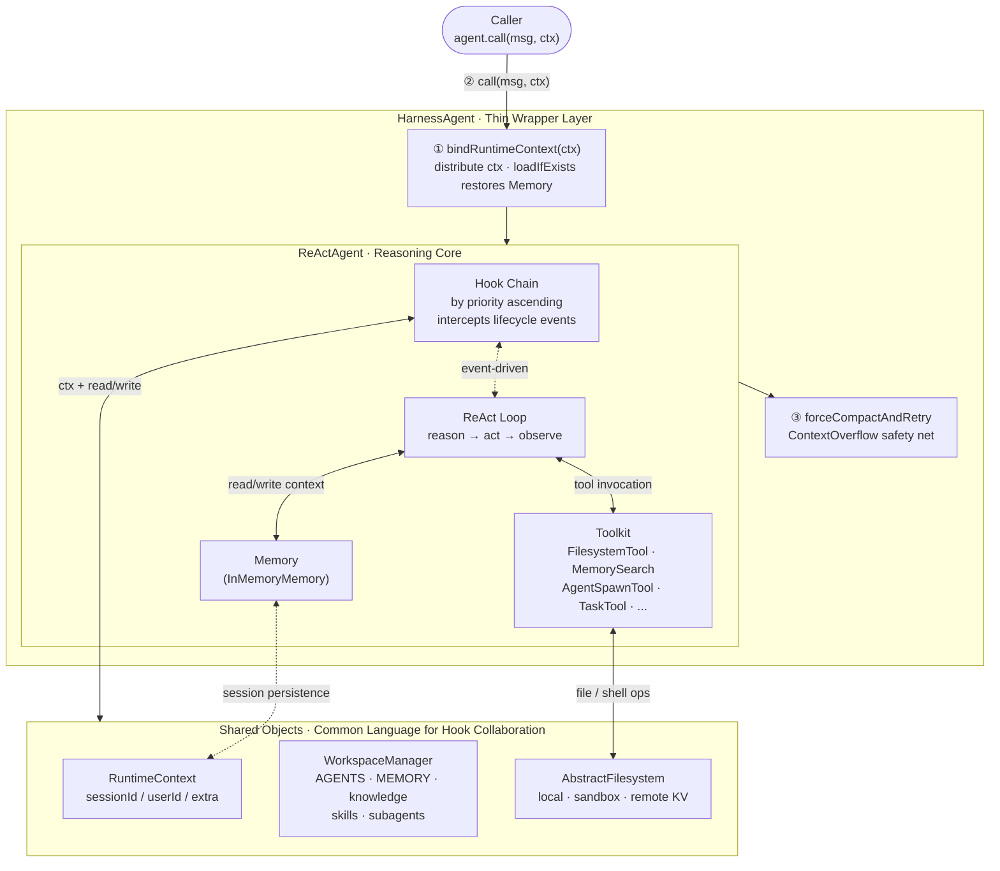
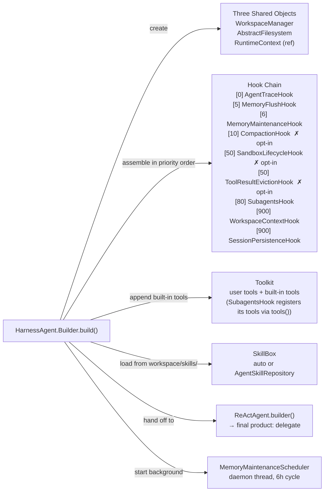
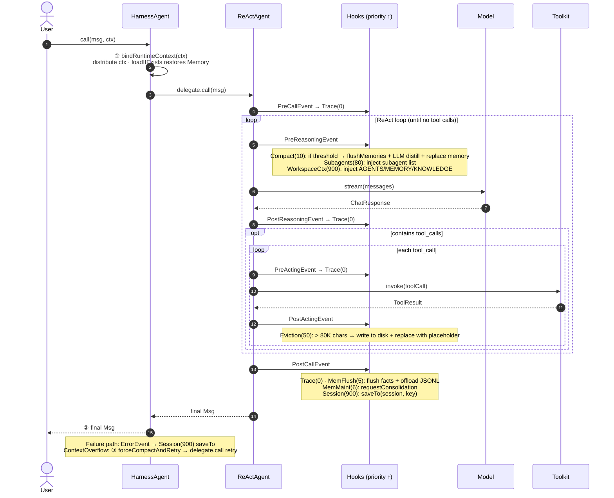
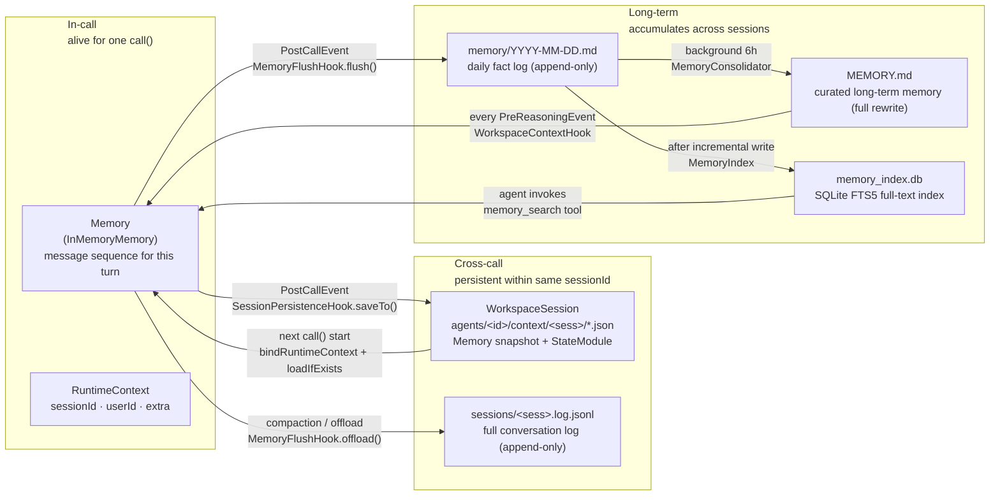
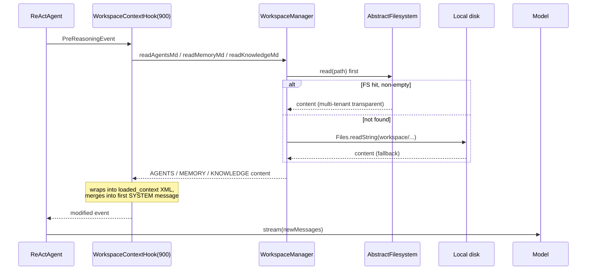
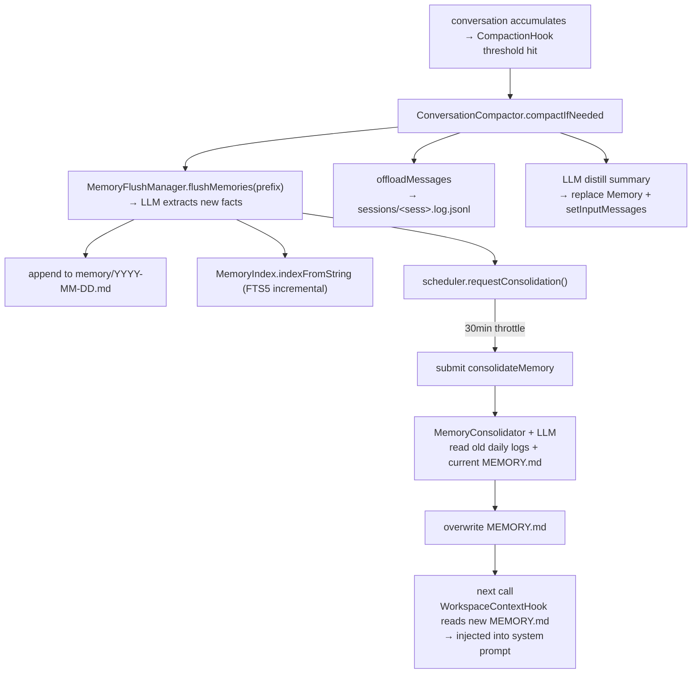
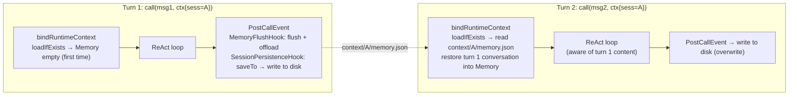
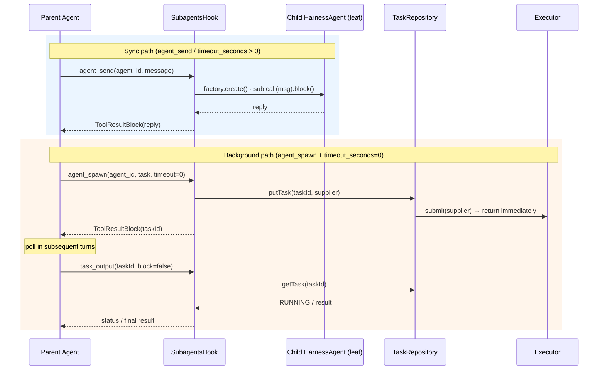

[Overview](/v1/en/docs/harness/overview) introduces Harness capabilities through the lens of "what problem they solve". This page takes a different angle: **explaining the architecture itself** — why it is designed this way, what each layer is responsible for, what happens during a `call()`, and how state flows through the system.

---

## 1. Design Philosophy

Understanding the Harness architecture starts with three core decisions.

### Decision 1: Thin Wrapper, Not a New Reasoning Loop

`HarnessAgent` is not a new reasoning engine — it is a **thin wrapper** around `ReActAgent` that does exactly two extra things:

- **`bindRuntimeContext(ctx)`**: at the start of each `call()`, distributes the current identity (`sessionId`, `userId`) to interested hooks and restores Memory state from the Session as needed;
- **`forceCompactAndRetry`**: if the model actually returns a `ContextOverflow` error, forces compaction and retries once.

Everything else — workspace injection, memory management, session persistence, subagent orchestration — is injected through ReActAgent's existing **Hook** and **Toolkit** extension points. The benefit: all of ReActAgent's capabilities are preserved unchanged; Harness only adds, never replaces.

### Decision 2: Hook-Driven, Orthogonal Capabilities

Each hook has a single responsibility and its execution order within the same event is determined by `priority`:

- `CompactionHook(10)` checks whether history needs compaction before each reasoning turn;
- `SubagentsHook(80)` injects the subagent list before reasoning;
- `WorkspaceContextHook(900)` is the last to run — because it assembles the final system prompt and must layer on top of all preceding processing.

Hooks **hold no references to each other** and communicate only through three shared objects. Each capability can be independently toggled: `compaction` requires explicit configuration, `session persistence` is on by default, `toolResultEviction` is opt-in.

### Decision 3: Shared Objects Are the Only Coupling Point

All hooks collaborate through the same "common language":

| Object | Responsibility | Lifecycle |
|--------|---------------|-----------|
| `RuntimeContext` | Current `call()` identity: sessionId, userId, session reference, extra data | Re-injected on every `call()`, **not persisted** |
| `WorkspaceManager` | Stateless workspace accessor: two-layer reads (filesystem first → local fallback), writes go through filesystem | Created at build time, reused across calls |
| `AbstractFilesystem` | Storage backend: local disk / sandbox / KV store, pluggable | Created at build time, reused across calls |

---

## 2. Top-Level Architecture Diagram

**Three layers, one glance**:

- **Thin wrapper layer** (HarnessAgent): per-call identity binding and extreme-case recovery;
- **Reasoning core** (ReActAgent): Hook event pipeline + ReAct loop + tool execution;
- **Shared objects layer**: three objects that serve as the collaboration substrate for all hooks — belonging to no hook, read/written by all.

---

## 3. Build Phase (`Builder.build()`)

Capability injection happens once, during the **build phase**. After `build()` completes, the hook chain and toolkit composition are fixed for the lifetime of the agent:

> **✗ opt-in** hooks are only assembled when conditions are met: `CompactionHook` requires `.compaction(...)`; `SandboxLifecycleHook` requires `filesystem(SandboxFilesystemSpec)`; `ToolResultEvictionHook` requires `.toolResultEviction(...)`.

---

## 4. Hook Event Pipeline

`ReActAgent` fires events at key points in the ReAct loop; hooks execute in **ascending priority order** at their subscribed events. The complete Hook × Event matrix:

| Event | When | Hooks that fire (priority ascending) |
|-------|------|--------------------------------------|
| `PreCallEvent` | Before reasoning loop starts | `AgentTraceHook`(0) |
| `PreReasoningEvent` | **Before each** model call | `AgentTraceHook`(0) → `CompactionHook`(10) → `SubagentsHook`(80) → `WorkspaceContextHook`(900) |
| `PostReasoningEvent` | After each model response | `AgentTraceHook`(0) |
| `PreActingEvent` | Before each tool call | `AgentTraceHook`(0) |
| `PostActingEvent` | After each tool call | `AgentTraceHook`(0) → `ToolResultEvictionHook`(50) |
| `PostCallEvent` | After final reply is produced | `AgentTraceHook`(0) → `MemoryFlushHook`(5) → `MemoryMaintenanceHook`(6) → `SessionPersistenceHook`(900) |
| `ErrorEvent` | When an exception occurs | `AgentTraceHook`(0) → `SessionPersistenceHook`(900) |

The priority arrangement reflects design intent:

- **0**: pure logging, always first, never modifies events;
- **5/6/10**: memory and compaction, handling context lifecycle outside the reasoning loop;
- **50**: sandbox lifecycle and tool result offloading, handled in-place during acting;
- **80**: subagent injection, before workspace context — because subagent information must appear inside the system prompt;
- **900**: final system prompt assembly (`WorkspaceContextHook`) and persistence (`SessionPersistenceHook`) — ensuring they layer on top of all prior processing, and that memory is flushed before snapshotting.

---

## 5. `call()` Lifecycle Sequence

---

## 6. State Flow

State in Harness has three layers, from shortest to longest lived:

**Core pattern**:
- `Memory` is the in-call "working memory", persisted via two paths when `call()` ends;
- `WorkspaceSession` ensures "the next call with the same sessionId still remembers this turn";
- `MEMORY.md` + FTS index ensures "long-term facts survive session boundaries".

---

## 7. Four Typical Collaboration Scenarios

### Scenario A — How Workspace Files Become the Model's System Prompt

### Scenario B — How Facts Settle into `MEMORY.md` Over a Long Session

### Scenario C — How the Same `sessionId` Remembers Across Calls

### Scenario D — Parent Agent Delegates to Subagent: Sync and Background Paths

---

## Related Pages

- [Workspace](/v1/en/docs/harness/workspace) — workspace directory structure, `WorkspaceManager` two-layer read/write details
- [Memory](/v1/en/docs/harness/memory) — two-layer memory model, compaction configuration, FTS5 retrieval
- [Filesystem](/v1/en/docs/harness/filesystem) — `AbstractFilesystem` three modes and extension patterns
- [Subagent](/v1/en/docs/harness/subagent) — subagent declaration format, `TaskRepository`, five-row decision table
- [Session](/v1/en/docs/harness/session) — `WorkspaceSession` / `JsonSession` serialization protocol
- [Tool](/v1/en/docs/harness/tool) — built-in tool reference and registration
