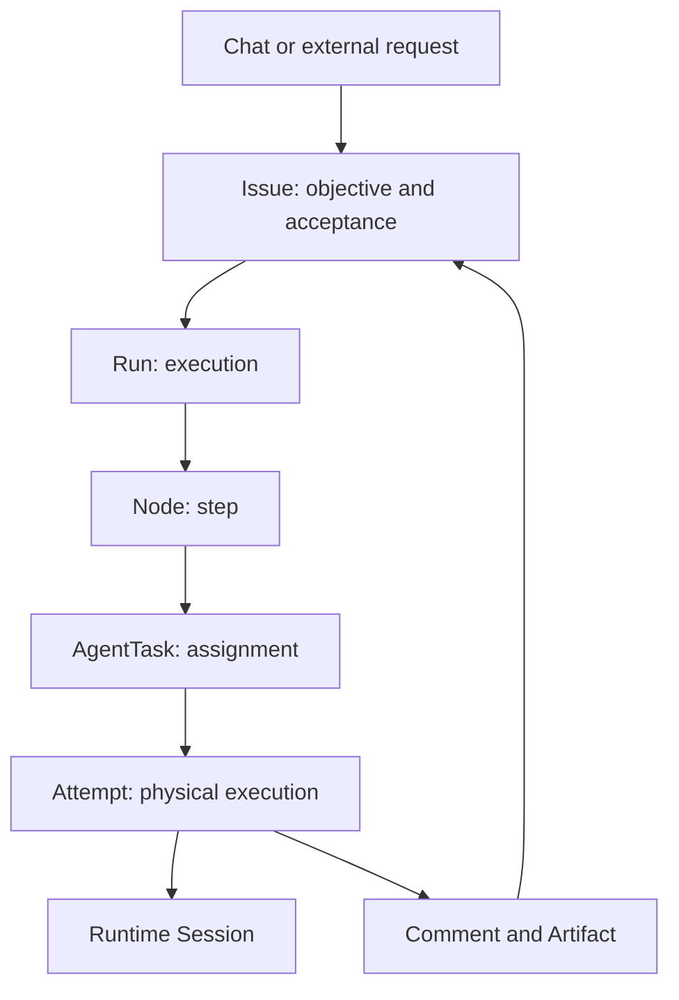

[简体中文](/v2/zh/service/concepts)

Separate the work objective, the capability responsible for it and the runtime that executes it.

## Work and execution

| Object | Question it answers |
| --- | --- |
| Chat | What am I discussing with an Agent? Personal, multi-turn interaction |
| Issue | What must be delivered, who owns it and how is it accepted? |
| Comment / Artifact | Where are discussions and file deliverables? |
| Run / Node | Which steps belong to this execution? |
| AgentTask / Attempt | Who receives work, and what happened in this physical execution? |
| Session | Which continuing model or provider context is used? |
| Approval | May an operation proceed? Separate from deliverable acceptance |

The diagram describes work-oriented requests; ordinary Chat does not require an Issue. Retries can create new Attempts or Runs while preserving the Issue. Execution success and business acceptance are distinct.

## Capability definitions

An Agent combines reusable responsibilities and runtime configuration. Managed uses Service Harness, Hosted uses a provider on Runtime Host and External keeps an independent application.

A Team collaborates adaptively through a Lead and members. A Workflow pins a published step graph. An Automation triggers work on schedules or events. A Channel is a messaging entry, and an Endpoint is a programmatic entry. These can reuse Agents while retaining their own configurations and lifecycles.

## Resources and permissions

Workspace stores guidance, skills, tools and subagent files. Environment selects Managed tool execution. Memory holds shared knowledge; Vault holds connection credentials. Resources need consumer bindings and authorization after creation.

Namespace organizes resources and member permissions. Work can additionally be private or shared. Agent visibility does not grant access to every private task involving it.

## Versions

Agent definitions, Workspaces, Teams and Workflows evolve. A Workflow revision is a published snapshot; an Endpoint release selects the currently exposed target. Inspect actual execution records and verify configuration changes with new work.

Next: [Your first conversation and deliverable](/v2/en/service/first-session).
