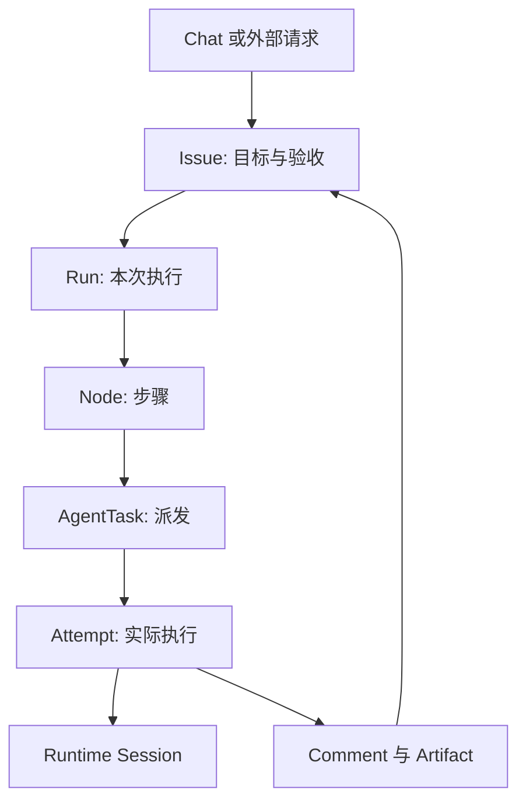

[English](/v2/en/service/concepts)

先区分“要做什么”“谁来做”和“在哪里运行”，再配置具体功能。

## 工作与执行

| 对象 | 回答的问题 |
| --- | --- |
| Chat | 我与一个 Agent 正在讨论什么？个人多轮入口 |
| Issue | 要交付什么、谁负责、如何验收？持久工作记录 |
| Comment / Artifact | 讨论和文件成果在哪里？ |
| Run / Node | 本次工作按什么步骤推进？ |
| AgentTask / Attempt | 派给谁、这一次实际执行发生了什么？ |
| Session | 模型或 provider 使用什么持续上下文？ |
| Approval | 当前操作是否获准继续？与交付验收分开 |

图展示工作型请求；纯 Chat 不要求先创建 Issue。重试可产生新的 Attempt 或 Run，原 Issue 保留。执行成功只说明本次运行的结果，是否达到业务目标还取决于 Issue 的完成策略与验收。

## 能力定义

Agent 是可复用的职责和运行配置。Managed 使用 Service Harness；Hosted 使用 Runtime Host 上的 provider；External 保留独立应用。

Team 由 Lead 和成员动态协作；Workflow 以已发布 revision 固定步骤图。Automation 根据计划或事件发起工作。Channel 提供消息平台入口；Endpoint 提供程序调用入口。它们可以共同使用同一批 Agent，但各有独立的配置与生命周期。

## 资源与权限

Workspace 保存操作说明、技能、工具和子 Agent 文件；Environment 决定 Managed 工具执行位置；Memory 保存共享知识；Vault 保存连接凭据。资源被创建后，还需要绑定给消费者并满足访问权限。

Namespace 组织资源和成员权限。Chat/Issue 等工作还可以有私有或共享访问范围。看得到 Agent 不代表可以阅读它参与的全部私人工作。

## 版本

Agent 定义、Workspace、Team 和 Workflow 都可能演进。Workflow revision 是发布快照；Endpoint release 决定调用入口当前指向的目标。验证配置时查看实际执行记录，并用新工作确认变更效果。

下一步：[第一次对话与交付](/v2/zh/service/first-session)。
